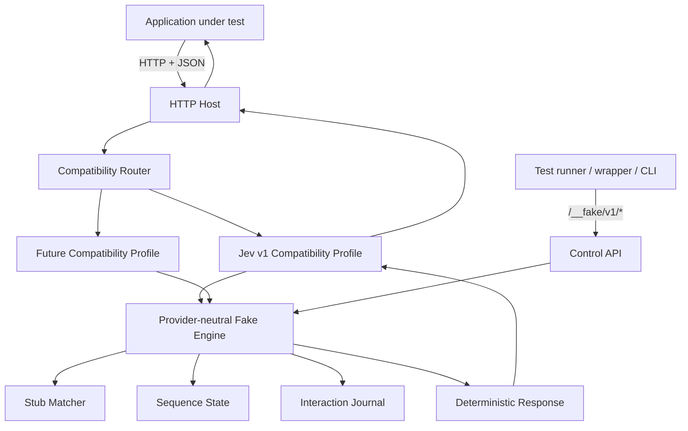

# fake-jev: Technical Specification and System Design v2

**Status:** Normative, implementation-authoritative v1 product specification  
**Specification version:** 2.0  
**Date:** 2026-09-25  
**Primary implementation language:** Go  
**Minimum supported Go toolchain for contributors:** Go 1.26  
**Primary CI Go toolchain:** Go 1.27.x  
**Primary distribution:** Native standalone binary  
**Planned secondary target:** WebAssembly  
**Primary interoperability boundary:** HTTP + JSON  
**Initial compatibility profile:** `jev/v1`


---

## 0. Normative status, terminology, and precedence

This document is the implementation source of truth for `fake-jev` v1.

The words **MUST**, **MUST NOT**, **REQUIRED**, **SHALL**, **SHALL NOT**, **SHOULD**, **SHOULD NOT**, **RECOMMENDED**, **MAY**, and **OPTIONAL** are to be interpreted as normative requirement levels in the RFC 2119 / RFC 8174 sense when written in uppercase.

For implementation agents and maintainers:

- **MUST / MUST NOT** define v1 conformance and are not discretionary.
- **SHOULD / SHOULD NOT** are strong implementation guidance. Deviations require a documented technical reason and MUST NOT alter a MUST-level public contract.
- **MAY / OPTIONAL** identify behavior that is permitted but is not required for v1.
- lowercase descriptive words such as “may” or “should” outside normative contract sections do not create a public API guarantee.
- functionality listed under **Decisions intentionally deferred** MUST NOT be implemented as public v1 behavior unless this specification is revised first.

### 0.1 No invention rule

When observable behavior is not defined by this specification, an implementation MUST NOT invent a new public feature, protocol, configuration key, endpoint, compatibility claim, fallback, plugin mechanism, or default.

The implementation MUST choose the smallest private implementation that satisfies the defined contracts. If a required observable behavior is genuinely unspecified, it is a specification gap and MUST be surfaced rather than silently standardized by code.

### 0.2 Source-of-truth hierarchy

The v1 contracts are intentionally expressed in multiple forms: prose, schemas, and contract vectors. They are expected to agree.

If implementation work discovers a conflict between them, the agent MUST stop that conflicting implementation path and report the conflict. It MUST NOT select whichever interpretation is most convenient.

Within a non-conflicting specification, the following are all normative:

1. explicit MUST/MUST NOT requirements;
2. the exact wire contracts in Sections 37-44;
3. configuration and control-plane schemas in this document;
4. golden contract vectors in Section 44;
5. phase acceptance gates and Definition of Done.

Examples are normative only where they are explicitly labeled **Golden contract vector** or **Exact response**. Other examples are illustrative.

### 0.3 Public contracts versus private implementation

The following are public/versioned v1 contracts:

- the `jev/v1` emulated HTTP behavior documented here;
- `/__fake/v1/*` control API behavior;
- configuration `schemaVersion: 1`;
- documented CLI commands, flags, exit semantics, and environment injection;
- strict matching semantics;
- verification semantics.

The following are private implementation details and MAY change without compatibility guarantees:

- Go package names and unexported types;
- locking strategy;
- in-memory data structures;
- internal matcher representation;
- logging internals;
- how profile configuration is compiled into the engine.

### 0.4 Design objective

The system MUST be easy for a low-reasoning implementation agent to implement correctly because correctness is constrained by explicit contracts rather than architectural guesswork.

The implementation strategy is therefore:

```text
specification
    |
    v
exact wire/config contracts
    |
    v
golden contract vectors
    |
    v
implementation
    |
    v
contract tests
    |
    v
conformance
```

The test suite, not model intuition, is the final enforcement mechanism.

---

## 1. Executive summary

`fake-jev` is a lightweight, deterministic, local test server for software that integrates with Jev or other System One-style decision APIs.

Its purpose is simple:

> Applications must be testable without starting a model, downloading model weights, making an external API call, requiring an API key, or spending money.

A developer should be able to replace:

```text
https://api.typesafe.ai
```

with:

```text
http://localhost:8787
```

and continue using the same application client, SDK, HTTP code, or provider implementation.

The first public compatibility target is the current Jev HTTP API because that is the most recognizable integration surface today. The architecture, however, must not treat the current Jev API as a System One standard. No official stable cross-provider System One protocol exists yet.

Therefore the central architectural rule is:

> **fake-jev emulates protocols; it does not define the protocol.**

Provider-specific routes, schemas, primitives, validation behavior, and response shapes live behind versioned compatibility profiles. The fake engine itself only knows how to match requests, select deterministic responses, advance scenarios, record interactions, and report unmatched calls.

The project is intentionally small. It is not an inference engine, model simulator, evaluation framework, generic service-virtualization platform, or attempt to standardize System One.

---

## 2. Problem statement

Applications using decision models such as Jev need normal software testing capabilities:

- unit and integration tests must run offline;
- CI must not depend on external services;
- CI must not spend tokens or API credits;
- tests must be deterministic and reproducible;
- developers must be able to force specific decisions and edge cases;
- tests must verify what the application asked the decision service;
- applications written in any language should be able to use the same fake;
- the fake must survive changes in provider APIs without requiring a redesign of its core.

An in-process mock provider solves only part of the problem. It is tied to a language or SDK and often bypasses serialization, HTTP integration, endpoint configuration, client behavior, authentication headers, and protocol validation.

`fake-jev` instead runs as a real local HTTP process and emulates the external service boundary.

```text
Production

Application
    |
    v
real SDK/client
    |
    v
Jev / provider


Testing

Application
    |
    v
same SDK/client
    |
    v
fake-jev
localhost
```

Only the endpoint changes.

---

## 3. Product definition

### 3.1 What fake-jev is

`fake-jev` is:

- a standalone local HTTP server;
- a deterministic test double for System One-style APIs;
- Jev-compatible at the HTTP boundary for its first compatibility profile;
- language-neutral from the application's point of view;
- controlled by a versioned configuration format and control API;
- suitable for local development, integration tests, end-to-end tests, CI, containers, and language-specific test wrappers;
- implemented in Go initially;
- designed so its core semantics can later be exposed through WebAssembly without redesigning the system.

### 3.2 What fake-jev is not

`fake-jev` is explicitly **not**:

- a replacement model;
- a local Jev implementation;
- a simulator of Jev's intelligence;
- a model-quality evaluation framework;
- a benchmark for comparing providers;
- a proxy that silently calls the real provider;
- a general-purpose WireMock replacement;
- a specification for what “System One compatible” means;
- a production inference service;
- an LLM-backed fake;
- a system that guesses what Jev would have answered.

The correct mental model is:

> **The developer decides what the fake answers. fake-jev makes the real application experience that answer through the real protocol boundary.**

---

## 4. Product principles

These principles are architectural constraints, not suggestions.

### 4.1 HTTP is the universal interoperability boundary

The primary public integration surface is HTTP + JSON.

Any language that can make an HTTP request can use `fake-jev`.

Language wrappers are convenience layers, not alternate implementations.

### 4.2 The fake engine is provider-neutral

The engine must not know that Jev has:

- `/v1/systemone`;
- `/v1/models`;
- `choice`;
- `noul`;
- `score`;
- `model`;
- `usage`.

Those are compatibility-profile concerns.

### 4.3 Provider APIs are dialects, not standards

The current Jev API must be treated as one external dialect.

A breaking Jev change or a new provider should normally require a new or updated compatibility profile, not modifications to the engine.

### 4.4 Jev is the product entry point, not the architecture

The project is called `fake-jev` because Jev is currently the recognizable name and expected discovery path.

Internally, provider-neutral terminology must be used except inside Jev-specific compatibility code.

Avoid names such as:

```text
JevMatcher
JevScenario
JevEngine
JevFixtureStore
```

Prefer:

```text
Matcher
Scenario
Engine
Exchange
Interaction
Stub
```

Jev-specific code belongs under a compatibility package.

### 4.5 Determinism by default

The same configuration and request sequence must produce the same responses and state transitions.

No randomness, clocks, external network calls, or hidden retries may affect normal matching behavior.

If deterministic pseudo-random behavior is introduced later, it must require an explicit seed.

### 4.6 Fail closed in tests

An unconfigured decision request must not silently receive a plausible default in strict mode.

Unknown requests must be visible and should fail CI unless the user explicitly configures fallback behavior.

### 4.7 Add before modifying

New provider protocols, new versions, new runtimes, and new wrappers should usually be added at the edges.

The core should not need modification when a new compatibility profile is introduced.

### 4.8 Do not abstract hypothetical requirements

The codebase must preserve clear boundaries without pre-building a framework for every imagined future use case.

Do not introduce plugin registries, provider factories, storage abstractions, transport factories, DI frameworks, or execution-backend hierarchies until a second real implementation requires them.

### 4.9 Zero-model execution is a product requirement

Running `fake-jev` must never require:

- model weights;
- GPU access;
- model runtimes;
- provider credentials;
- network access;
- paid APIs.

---

## 5. Relationship to system-one-core

`system-one-core` and `fake-jev` solve related but different testing problems.

`system-one-core` already supports a provider-neutral application abstraction and deterministic in-process test providers. That is ideal for fast unit tests inside TypeScript.

`fake-jev` operates one boundary lower:

```text
                 Application
                     |
             system-one-core
                     |
          HttpSystemOneProvider
                     |
                HTTP/JSON
                     |
                 fake-jev
```

This tests more of the real integration path:

- request construction;
- serialization;
- base URL configuration;
- HTTP client behavior;
- protocol validation;
- response decoding;
- application behavior.

The projects should complement each other. `fake-jev` must not depend on the TypeScript `system-one-core` package.

A cross-project integration test should eventually verify that `system-one-core` can point its `HttpSystemOneProvider` at `fake-jev` and execute representative `choice`, `noul`, and `score` requests.

---

## 6. Current Jev compatibility snapshot

This section records the initial upstream target. It is a compatibility input, not a core-domain definition and not a claim that an official cross-provider “System One” standard exists.

**Snapshot date:** 2026-09-25  
**Observed upstream API description version:** `0.2.0`  
**Observed OpenAPI version:** `3.1.0`  
**Snapshot source:** `https://api.typesafe.ai/openapi.json`

At the snapshot date, the public TypeSafe/Jev HTTP surface defines:

```text
POST /v1/systemone
GET  /v1/models
```

`POST /v1/systemone` accepts a JSON object with required fields:

```text
state       string | object | array
model       string
questions   object with at least one named question
```

The currently documented question types are:

```text
noul
choice
score
```

The documented success response contains:

```text
model
answers
usage.input_tokens
usage.output_tokens
```

The current upstream API declares HTTP bearer authentication. `fake-jev` MUST accept clients that send bearer authentication but MUST NOT validate credentials or perform external authentication in v1.

### 6.1 Compatibility-profile identity

The built-in profile implementing the frozen behavior in this specification is:

```text
jev/v1
```

The profile identifier is owned by `fake-jev`. It does not imply that TypeSafe has published an API version named `jev/v1`.

The convenience alias:

```text
jev
```

MUST resolve to `jev/v1` in `fake-jev` product major version 1. Long-lived CI configuration SHOULD use the explicit `jev/v1` identifier.

If upstream behavior changes incompatibly, the project MUST preserve released `jev/v1` behavior and add a new compatibility profile such as `jev/v2` rather than silently changing the old profile.

### 6.2 Frozen-snapshot rule

Once `jev/v1` is released, its observable behavior is defined by this specification and its golden tests, not by whatever the live TypeSafe service does later.

Upstream drift MAY motivate a new profile, but MUST NOT silently mutate `jev/v1`.

---

## 7. High-level system design



### 7.1 Dependency direction

Dependencies point toward the core behavior.

```text
CLI --------------------+
                        |
HTTP host --------------+----> compatibility profile ----> engine
                        |
future WASM host -------+

control API -------------------------------> engine
```

The engine must not import:

```text
net/http
CLI packages
provider-specific packages
process management
Docker-specific code
npm-specific code
GitHub Actions code
```

Filesystem configuration loading belongs outside the engine.

---

## 8. Core domain model

The core domain intentionally contains only fake-server concepts.

Suggested conceptual types follow. Exact Go names may evolve, but the separation must remain.

### 8.1 Exchange

Represents a compatibility profile's normalized incoming operation.

```go
type Exchange struct {
    Profile   string
    Operation string
    Payload   Value
    Metadata  map[string]Value
}
```

`Value` is a JSON-compatible value tree or equivalent internal representation.

The engine MUST NOT require a compile-time union of `choice | noul | score`.

### 8.2 Stub

A deterministic rule containing:

```text
id
priority
matcher
response action
optional usage expectation
optional invocation expectation
```

### 8.3 Matcher

A matcher answers only:

```text
Does this stub match this exchange under the current deterministic matcher inputs?
```

The generic engine should support only generally useful matching primitives. Compatibility profiles may compile friendly provider-specific configuration into these primitives.

### 8.4 Response action

A response action produces a profile result from a matched exchange.

The core MUST support the v1 response mechanisms required by the profiles:

```text
static deterministic response
response sequence
raw/emulated provider response
fake-server failure result
```

Artificial latency/delay injection is not part of v1.

### 8.5 Sequence state

v1 supports only per-stub response-sequence state for deterministic multi-call workflows. Named scenarios and general state-machine DSLs are deferred.

Example:

```text
first retry decision  -> yes
second retry decision -> no
```

Sequence state is in memory and resets according to Sections 40 and 41.

### 8.6 Interaction journal

Every data-plane request admitted within the journal capacity MUST be recorded with enough information for assertions and debugging. Journal-overflow behavior is defined separately in Sections 19 and 43.

Minimum fields:

```text
sequence number
profile
operation
received timestamp for diagnostics only
normalized request
raw request body when available
matched stub id or unmatched marker
response status
sequence position before/after when applicable
```

Timestamps MUST NOT participate in matching or response generation.

---

## 9. Compatibility profiles

A compatibility profile translates an external protocol into and out of the neutral engine.

A profile owns:

1. route recognition;
2. request decoding;
3. provider-specific validation;
4. provider-specific fixture helpers;
5. response construction/encoding;
6. protocol-specific defaults;
7. model-list behavior when relevant;
8. profile-specific conformance tests.

Conceptually:

```go
type Profile interface {
    ID() string
    MatchRoute(meta RequestMeta) bool
    Decode(input HostRequest) (Exchange, error)
    Encode(result Result) (HostResponse, error)
}
```

The actual interface should remain as small as practical. Do not add methods solely to anticipate future providers.

### 9.1 Compile-time registration in v1

Compatibility profiles are compiled into the binary in v1.

Do not implement dynamic native Go plugins.

A simple internal registration mechanism is sufficient:

```go
register(jevV1Profile)
```

### 9.2 Future plugin path

If third-party compatibility profiles become a real requirement, WebAssembly is the preferred future extension mechanism because it is portable and sandboxable.

No external plugin ABI is part of v1.

---

## 10. Public data plane

The **data plane** is what the application under test sees.

For the initial `jev/v1` profile:

```text
POST /v1/systemone
GET  /v1/models
```

The goal is wire compatibility sufficient for normal clients and SDKs to point to `fake-jev` by changing only their base URL.

### 10.1 Authentication

Default behavior:

- accept requests with no Authorization header;
- accept arbitrary bearer tokens;
- never validate tokens externally;
- never call a provider.

A future strict-auth simulation option may be added if real demand appears.

### 10.2 Model behavior

The fake does not execute a model.

`GET /v1/models` MUST follow Section 39.1. The default model list contains the deterministic `jev-latest` entry defined there.

For `/v1/systemone`, response model behavior MUST follow Section 13.6 and Section 39.4: a configured `then.model` wins; otherwise the request model is echoed.

Model metadata is test data, not a claim that a real model exists locally.

### 10.3 Usage behavior

Default token usage MUST be exactly:

```json
{
  "input_tokens": 0,
  "output_tokens": 0
}
```

A stub MAY explicitly configure non-negative integer usage values as defined in Section 13.6.

### 10.4 Validation

Validation belongs to the compatibility profile, not the engine.

`jev/v1` request validation MUST follow Section 39.2 and MUST return the deterministic `422` envelope in Section 39.3.

Exact live-upstream framework wording beyond that frozen fake contract is not emulated.

### 10.5 Unknown fields

Unknown-field behavior is a profile concern.

The core must not discard fields merely because it does not understand them.

Raw request data should remain available to the profile and interaction journal.

---

## 11. Control plane

The control plane is owned by `fake-jev` and is intentionally separate from emulated provider routes.

All v1 control endpoints MUST live under:

```text
/__fake/v1
```

Control-plane requests MUST NOT be added to the application interaction journal.

All JSON control responses MUST use `Content-Type: application/json` unless the response status is `204 No Content`.

### 11.1 Required v1 endpoints

The following endpoints are REQUIRED:

```text
GET    /__fake/v1/health
GET    /__fake/v1/meta
POST   /__fake/v1/stubs
GET    /__fake/v1/stubs
DELETE /__fake/v1/stubs
GET    /__fake/v1/requests
DELETE /__fake/v1/requests
POST   /__fake/v1/reset
GET    /__fake/v1/verify
```

Their exact response contracts are defined in Section 41.

### 11.2 Static and dynamic stubs

Static stubs are loaded from configuration at server startup.

Dynamic stubs are added through `POST /__fake/v1/stubs`.

Rules:

- every stub MUST have a non-empty unique `id`;
- a duplicate static stub ID MUST make configuration validation fail;
- a dynamic stub whose ID conflicts with any active static or dynamic stub MUST be rejected with HTTP `409`;
- `DELETE /__fake/v1/stubs` MUST delete dynamic stubs only;
- static stubs MUST remain active until process restart or a full configuration reload mechanism is introduced in a future version;
- `POST /__fake/v1/reset` MUST remove all dynamic stubs and restore all static stubs to their initial sequence position and invocation count.

### 11.3 Interaction history

The server MUST record data-plane interactions in a monotonically increasing sequence order beginning at `1`.

`DELETE /__fake/v1/requests` MUST clear the interaction history and reset the next interaction sequence to `1`.

`POST /__fake/v1/reset` MUST also clear the interaction history and reset the next sequence to `1`.

### 11.4 Verification

Verification is a first-class v1 feature and MUST NOT be left to wrapper-specific interpretation.

`GET /__fake/v1/verify` MUST calculate the verification result defined in Section 41.9.

Verification MUST fail when any of the following occurred since the last reset/clear lifecycle boundary:

- an unmatched data-plane request;
- an unknown data-plane route;
- a profile validation failure;
- response sequence exhaustion;
- interaction journal overflow;
- a fake-server internal failure;
- an unsatisfied stub invocation expectation.

An intentionally configured raw/emulated provider error such as HTTP `429` MUST NOT itself fail verification.

### 11.5 Control-plane stability

The control API is a project-owned public contract.

Breaking changes require a new namespace such as:

```text
/__fake/v2
```

A product release MUST NOT silently change v1 control semantics.

---

## 12. Configuration and fixture format

The configuration format is a project-owned public contract.

The human-authored formats are YAML and JSON. Both MUST deserialize to the same logical schema.

The top-level configuration MUST use:

```yaml
schemaVersion: 1
```

### 12.1 Configuration precedence

Configuration precedence is fixed:

```text
explicit CLI flag
    overrides
configuration file value
    overrides
built-in default
```

No environment variable implicitly overrides fake-server host, port, mode, limits, profiles, or fixture configuration in v1.

The only environment-variable behavior defined by v1 is the child-process URL injection performed by `fake-jev run`.

### 12.2 Built-in defaults

If omitted, v1 MUST use:

```yaml
server:
  host: 127.0.0.1
  port: 8787

mode: strict
compatibility:
  - jev/v1

limits:
  dataPlaneBodyBytes: 8388608       # 8 MiB
  controlPlaneBodyBytes: 2097152    # 2 MiB
  maxInteractions: 10000
  logBodyBytes: 4096
  gracefulShutdownSeconds: 5

models:
  - name: jev-latest
    description: Local deterministic fake model provided by fake-jev.
    release_date: "1970-01-01"

stubs: []
```

`strict` is the only execution mode supported by v1. Any other mode value MUST fail validation.

### 12.3 Required top-level logical schema

```yaml
schemaVersion: 1

server:                 # optional
  host: 127.0.0.1       # optional string
  port: 8787             # optional integer 0..65535

mode: strict             # optional; only "strict" is valid in v1

compatibility:           # optional; default [jev/v1]
  - jev/v1

limits:                  # optional
  dataPlaneBodyBytes: 8388608
  controlPlaneBodyBytes: 2097152
  maxInteractions: 10000
  logBodyBytes: 4096
  gracefulShutdownSeconds: 5

models:                  # optional; jev/v1 model-list payload
  - name: jev-latest
    description: Local deterministic fake model provided by fake-jev.
    release_date: "1970-01-01"

stubs:                   # optional
  - id: example
    profile: jev/v1
    priority: 0
    when: {}
    then: {}
    expect: {}
```

Unknown top-level configuration keys MUST fail validation. Unknown keys inside the project-owned `server`, `limits`, stub envelope, `when`, `then`, and `expect` objects MUST also fail validation.

Profile-specific response bodies inside `then.raw.body` are arbitrary JSON and are exempt from unknown-key validation.

### 12.4 Stub identity and registration order

Every stub MUST define:

```yaml
id: non-empty-string
profile: jev/v1
```

`priority` is optional and defaults to `0`.

Static stubs receive `registrationIndex` values `1..N` in configuration declaration order.

Dynamic stubs receive monotonically increasing registration indices beginning at `N+1`.

After `POST /__fake/v1/reset`, all dynamic stubs are removed and the next dynamic registration index MUST again be `N+1`.

### 12.5 `jev/v1` matcher shape

A v1 Jev stub `when` object supports exactly:

```yaml
when:
  operation: systemone        # optional, defaults to systemone for jev/v1
  model: jev-latest           # optional exact string match
  state:                      # optional exact JSON-value match
    any: json
  questions:                  # optional exact question-name/type set
    route: choice
    urgent: noul
```

Rules are defined precisely in Section 40.

v1 does not expose a generic JSONPath/regex/expression matcher language.

### 12.6 `jev/v1` response shapes

A stub MUST define exactly one of:

```text
then.answers
then.sequence
then.raw
```

A configuration that contains more than one MUST fail validation.

#### Single answer response

```yaml
then:
  answers:
    urgent:
      noul: 0.95
  model: optional-response-model
  usage:
    input_tokens: 0
    output_tokens: 0
```

`model` and `usage` are optional. Their deterministic defaults are defined in Section 39.

#### Sequence response

```yaml
then:
  sequence:
    - answers:
        retry:
          noul: 0.95
    - answers:
        retry:
          noul: 0.10
```

Each sequence element MUST be either an `answers` response or a `raw` response and MUST NOT contain another `sequence`.

Sequence exhaustion behavior is fixed in Section 40.

#### Raw response escape hatch

```yaml
then:
  raw:
    status: 429
    headers:
      content-type: application/json
    body:
      detail: rate limited
```

Raw responses are intentional emulated-provider behavior and MUST NOT be validated against `jev/v1` answer schemas.

Raw response status MUST be an integer from `100` through `599`.

Raw headers MUST be a string-to-string map.

### 12.7 Invocation expectations

`expect` is optional.

Valid forms are:

```yaml
expect:
  exactly: 1
```

or:

```yaml
expect:
  atLeast: 1
  atMost: 3
```

Rules:

- counts MUST be non-negative integers;
- `exactly` MUST NOT appear with `atLeast` or `atMost`;
- at least one of `atLeast` or `atMost` MUST be present in the range form;
- if both are present, `atLeast` MUST be less than or equal to `atMost`;
- no `expect` object means no invocation-count assertion.

A stub invocation counter increments whenever that stub is selected by matching, including an invocation that then fails because its response sequence is exhausted. This ensures extra calls are observable.

### 12.8 Raw escape hatch principle

The raw escape hatch exists so a provider protocol can evolve before a first-class fixture helper exists.

It MUST NOT turn fake-jev into a generic programmable mock server. v1 fixtures MUST remain data-only and MUST NOT execute code, templates, shell commands, JavaScript, or expressions.

---

## 13. Jev v1 fixture helpers

The `jev/v1` profile provides deterministic helpers for the three question types frozen in the upstream snapshot.

All numeric probabilities and confidence values MUST be finite numbers in the inclusive range `[0, 1]`.

For probability maps, the absolute difference between the sum and `1.0` MUST be no greater than `1e-6`.

### 13.1 Noul

Fixture forms:

```yaml
urgent:
  noul: 0.94
```

and the convenience boolean form:

```yaml
urgent:
  noul: true
```

Conversion is exact:

```text
true  -> 1.0
false -> 0.0
```

The emitted answer MUST be:

```json
{
  "type": "noul",
  "noul": 0.94
}
```

A noul helper applied to a non-noul request question MUST make configuration/response generation fail as a fake-server error; it MUST NOT coerce question types.

### 13.2 Choice

Minimal fixture:

```yaml
route:
  choice: backend
```

The selected choice MUST exist as a key in the request question's `criteria` object.

When `probabilities` is omitted, the profile MUST generate a one-hot distribution over **all** request criteria keys:

```text
selected choice -> 1.0
all others      -> 0.0
```

When `confidence` is omitted, it MUST default to `1.0`.

Example emitted answer:

```json
{
  "type": "choice",
  "choice": "backend",
  "confidence": 1.0,
  "probabilities": {
    "frontend": 0.0,
    "backend": 1.0,
    "infra": 0.0
  }
}
```

Explicit form:

```yaml
route:
  choice: backend
  confidence: 0.91
  probabilities:
    frontend: 0.06
    backend: 0.91
    infra: 0.03
```

For explicit probabilities:

- keys MUST exactly equal the request criteria key set;
- every value MUST be in `[0,1]`;
- values MUST sum to `1.0` within `1e-6`;
- the selected choice MUST have a probability equal to the maximum probability; ties at the maximum are allowed;
- if `confidence` is omitted while explicit probabilities are present, confidence MUST equal the selected choice probability.

### 13.3 Score

Minimal fixture:

```yaml
severity:
  score: 2
```

For request criteria of length `N`, the requested fake score MUST be within `[0, N-1]`.

The response legend MUST always be derived from the request criteria. Fixtures MUST NOT provide a separate `legend` in v1.

For criteria:

```json
["Can wait", "Needs attention this week", "Needs attention today"]
```

the legend MUST be:

```json
{
  "0": "Can wait",
  "1": "Needs attention this week",
  "2": "Needs attention today"
}
```

If `score` is an integer, omitted probabilities MUST produce a one-hot distribution at that level.

If `score` is fractional, omitted probabilities MUST use deterministic linear interpolation between the adjacent floor and ceiling levels.

For example, score `1.5` over levels `0,1,2` produces:

```json
{
  "0": 0.0,
  "1": 0.5,
  "2": 0.5
}
```

In general for non-integer `s`:

```text
lo = floor(s)
hi = ceil(s)
p(lo) = hi - s
p(hi) = s - lo
all other probabilities = 0
```

If `confidence` is omitted, it MUST default to `1.0`.

Explicit probabilities MAY be supplied:

```yaml
severity:
  score: 1.5
  confidence: 0.8
  probabilities:
    "0": 0.0
    "1": 0.5
    "2": 0.5
```

Explicit score probabilities:

- MUST use exactly the keys `"0"` through `"N-1"`;
- MUST be in `[0,1]`;
- MUST sum to `1.0` within `1e-6`;
- MUST have a probability-weighted expected value equal to `score` within `1e-6`.

### 13.4 Mixed requests

A single `/v1/systemone` request MAY contain heterogeneous questions.

A matched `answers` response MUST provide an answer for every requested question and MUST NOT provide answers for question names absent from the request.

The fixture helper type MUST match each request question type.

### 13.5 Partial answers are prohibited in strict v1

There is no implicit answer generation in v1 strict mode.

If a matched stub's `answers` map does not cover the exact request question-name set, response generation MUST fail with `fake_jev_invalid_stub_response` and verification MUST fail.

### 13.6 Response model and usage defaults

For a non-raw response:

- `then.model`, if provided, MUST be emitted verbatim;
- otherwise the response `model` MUST echo the request `model`;
- `then.usage`, if provided, MUST contain non-negative integer `input_tokens` and `output_tokens`;
- otherwise usage MUST be exactly `{ "input_tokens": 0, "output_tokens": 0 }`.

---

## 14. Auto mode

Auto-generated fake decisions are **not part of v1**.

v1 supports strict deterministic behavior only.

The following MUST fail configuration/CLI validation in v1:

```text
--mode auto
mode: auto
```

Reason: automatically choosing values reintroduces implicit behavior and weakens the project's primary testing guarantee. A future product version MAY define an auto mode, but only through a new explicit specification.

---

## 15. CLI specification

The CLI is implemented in Go in the same repository and compiled into the same native binary.

The required v1 commands are:

```text
fake-jev serve
fake-jev validate
fake-jev verify
fake-jev run
fake-jev version
```

v1 MUST NOT add interactive prompts. Commands MUST be usable non-interactively in CI.

### 15.1 `serve`

```bash
fake-jev serve \
  --host 127.0.0.1 \
  --port 8787 \
  --config ./fake-jev.yaml
```

Supported flags:

```text
--host <string>
--port <0..65535>
--config <path>
--compat <profile>        repeatable; replaces config compatibility list if supplied
--mode strict
--log-format text|json
--ready-file <path>
```

Defaults come from Section 12.

`--port 0` MUST request an ephemeral OS-assigned TCP port.

When `--ready-file` is supplied, the server MUST create the file **atomically only after the listener is active and the control API is ready**.

Exact ready-file JSON:

```json
{
  "url": "http://127.0.0.1:49152",
  "host": "127.0.0.1",
  "port": 49152,
  "pid": 1234,
  "controlApiVersion": "v1"
}
```

The ready file MUST be removed during clean shutdown if it still contains the PID of the current process. Wrappers MUST NOT be required to scrape human logs for readiness.

### 15.2 `validate`

```bash
fake-jev validate ./fake-jev.yaml
```

Behavior:

- MUST load YAML or JSON;
- MUST validate top-level schema;
- MUST validate all enabled profile-specific fixture data;
- MUST validate duplicate IDs and expectation rules;
- MUST perform all statically possible consistency checks;
- MUST NOT start a server;
- MUST make no network request.

Success output MAY be human-readable, but exit semantics are normative in Section 42.

### 15.3 `verify`

```bash
fake-jev verify --url http://127.0.0.1:8787
```

`verify` MUST call:

```text
GET /__fake/v1/verify
```

It MUST NOT duplicate verification logic in the CLI.

### 15.4 `run`

Canonical CI form:

```bash
fake-jev run \
  --config ./fake-jev.yaml \
  --url-env JEV_BASE_URL \
  -- npm test
```

The command after `--` is REQUIRED.

`run` MUST:

1. validate configuration;
2. start an in-process fake server on an available loopback port;
3. wait until the listener and control API are ready;
4. always set `FAKE_JEV_URL` in the child environment to the server base URL;
5. if `--url-env NAME` is supplied, also set `NAME` to the same URL, overriding an existing child value;
6. start the child process;
7. wait for the child process;
8. call the control-plane verify operation;
9. gracefully stop the server;
10. return the exit result defined in Section 42.

`run` MUST use an ephemeral port by default regardless of the `server.port` file value unless the caller explicitly passes a `--port` flag to `run`.

This avoids CI port collisions.

### 15.5 `version`

```bash
fake-jev version
```

Output MUST contain at least:

```text
product version
Go build/runtime version or build metadata
built-in compatibility profile IDs
control API version
config schema version
```

A machine-readable `--json` form MAY be added, but is not required for v1.

### 15.6 CLI parser dependency policy

A heavy CLI framework is not required. The implementation SHOULD use the standard library or a very small parsing layer. This is private implementation guidance and does not affect conformance.

---

## 16. Language wrappers

Potential wrappers include:

```text
fake-jev-ts
fake-jev-py
fake-jev-rs
fake-jev-go
fake-jev-java
```

Wrappers are optional conveniences.

They must not reimplement the fake engine.

Their responsibilities may include:

- locate/download the native binary;
- start and stop the server;
- allocate a port;
- wait for readiness;
- configure stubs through the control API;
- reset state;
- fetch interactions;
- expose assertion-friendly helpers;
- eventually choose a WASM-hosted execution strategy.

Example TypeScript UX:

```ts
const fake = await createFakeJev({
  mode: "strict",
});

await fake.stub({
  profile: "jev/v1",
  when: {
    operation: "systemone",
    questions: { urgent: "noul" },
  },
  then: {
    answers: {
      urgent: { noul: 0.95 },
    },
  },
});

console.log(fake.url);

await fake.reset();
await fake.stop();
```

The wrapper's semantics should map directly to the versioned control API.

### 16.1 Runtime strategy must remain replaceable

A future TypeScript wrapper could support:

```text
native binary
WASM hosted in Node/Deno
remote existing fake-jev server
```

The user-facing wrapper API should not need to change solely because the execution strategy changes.

---

## 17. Go implementation architecture

v1 repository layout SHOULD start as:

```text
fake-jev/
|
|-- cmd/
|   `-- fake-jev/
|       `-- main.go
|
|-- internal/
|   |-- engine/
|   |   |-- engine.go
|   |   |-- exchange.go
|   |   |-- stub.go
|   |   |-- matcher.go
|   |   |-- sequence.go
|   |   `-- journal.go
|   |
|   |-- compat/
|   |   `-- jev/
|   |       `-- v1/
|   |           |-- profile.go
|   |           |-- routes.go
|   |           |-- request.go
|   |           |-- response.go
|   |           |-- validation.go
|   |           |-- fixture.go
|   |           `-- models.go
|   |
|   |-- host/
|   |   `-- http/
|   |       |-- server.go
|   |       `-- router.go
|   |
|   |-- control/
|   |   |-- api.go
|   |   `-- handlers.go
|   |
|   |-- config/
|   |   |-- load.go
|   |   |-- schema.go
|   |   `-- validate.go
|   |
|   `-- cli/
|       |-- serve.go
|       |-- run.go
|       |-- verify.go
|       |-- validate.go
|       `-- version.go
|
|-- spec/
|   |-- control-api.openapi.yaml
|   |-- config.schema.json
|   `-- compat/
|       `-- jev-v1/
|           `-- openapi.snapshot.json
|
|-- test/
|   |-- conformance/
|   `-- integration/
|
|-- testdata/
|   `-- contracts/
|
|-- examples/
|-- docs/
|-- Dockerfile
|-- go.mod
|-- LICENSE
`-- README.md
```

### 17.1 Toolchain baseline

The repository `go.mod` MUST declare a minimum Go version of `1.26`.

CI MUST test at least:

```text
minimum supported Go 1.26.x
current Go 1.27.x
```

The implementation MUST NOT require Go 1.27-only language features unless the minimum version is intentionally raised in a future specification/release.

### 17.2 Dependency policy

Prefer the Go standard library.

Expected standard-library building blocks include:

```text
net/http
encoding/json
context
sync
os
os/exec
flag or equivalent small parser
```

One mature YAML dependency is acceptable.

Do not add frameworks for routing, dependency injection, logging, configuration, or testing unless a real need appears.

### 17.3 Engine purity

`internal/engine` must not import:

```text
net/http
os/exec
compat/jev
cli
control API packages
```

Avoid filesystem access inside the engine.

Configuration is loaded and compiled outside, then passed to the engine.

### 17.4 Concurrency

The HTTP host MAY process requests concurrently, but mutable fake-engine behavior MUST be race-free and deterministic with respect to the engine-assigned request order.

For every data-plane request that is admitted within the interaction-journal capacity, the server MUST atomically assign the next interaction sequence number before route/profile decoding, validation, or stub selection. This includes unknown routes, malformed JSON, and profile validation failures.

For that request, these operations MUST behave as one serialized state transition relative to other data-plane requests and control-plane mutations:

```text
assign sequence
route/decode/validate
select matching stub when validation succeeds
increment stub invocation count when selected
consume sequence position if applicable
produce/record outcome
```

This does not promise deterministic ordering between two network requests that truly race to reach the engine. Tests that require sequence-sensitive behavior MUST issue those calls in a controlled order.

Control mutations (`POST stubs`, `DELETE stubs`, `reset`, request-history clear) MUST be atomic relative to the engine state transitions above.

A reset racing with a request has only two legal outcomes:

```text
request transition completes, then reset applies
or
reset applies, then request sees reset state
```

Partially reset state is prohibited.

---

## 18. WebAssembly strategy

WASM is a planned secondary target, not a v1 blocker.

The project should be written so a future build can reuse the engine semantics without rewriting them.

### 18.1 Why WASM matters

Potential benefits include:

- embedding in Node.js and Deno test processes;
- browser-based playgrounds;
- portable execution in environments with a WASM runtime;
- sandboxed third-party compatibility adapters later;
- one engine implementation shared by multiple language wrappers.

### 18.2 What must be true now

To preserve the option:

- core behavior must not depend on HTTP;
- core behavior must not depend on process management;
- core behavior should avoid OS-specific APIs;
- request/response data should be representable as JSON-compatible values;
- deterministic state transitions should be callable as ordinary functions/methods;
- host responsibilities must remain outside the engine.

### 18.3 Native remains the default

The default runtime remains the native Go binary because it gives the simplest UX:

```bash
./fake-jev serve
```

WASM should be added only when an actual embedding use case justifies the host/runtime complexity.

### 18.4 Future WASM host shape

Conceptually:

```text
Node / Deno / Browser / other host
              |
              v
     fake engine WASM module
              |
              v
    deterministic exchange API
```

For normal application integration, a wrapper may still expose a localhost HTTP server so the application contract remains unchanged.

### 18.5 Future external plugins

If external compatibility plugins become necessary, prefer a WASM component boundary over Go native plugins.

Do not define that ABI in v1.

---

## 19. Security model

`fake-jev` is a local development and test utility.

### 19.1 Safe defaults

Default bind address:

```text
127.0.0.1
```

Do not bind publicly by default.

Users running in Docker may explicitly choose:

```text
0.0.0.0
```

### 19.2 No network egress

Core fake behavior must not make external network requests.

A test should be able to run `fake-jev` in an environment with outbound networking disabled.

### 19.3 No arbitrary code execution in fixtures

Do not support JavaScript expressions, Go templates with dangerous functions, shell commands, dynamic eval, or arbitrary code callbacks in configuration.

Fixtures are data.

If programmable extensions are required later, design an explicit sandboxed mechanism rather than adding `eval`-style features.

### 19.4 Resource limits

The default v1 limits are normative and defined in Section 12.2.

The host MUST enforce:

- data-plane body size before unbounded allocation: default 8 MiB;
- control-plane body size: default 2 MiB;
- interaction count: default 10,000;
- normal-log body preview: default 4 KiB;
- graceful shutdown timeout: default 5 seconds.

When a request body exceeds its plane's configured limit, the server MUST return HTTP `413 Payload Too Large`. A data-plane 413 MUST be journaled and MUST cause verification failure because the application interaction was not successfully emulated.

When the interaction journal has reached `maxInteractions`, the next data-plane request MUST return HTTP `507 Insufficient Storage` with error code `fake_jev_journal_full`; the condition MUST cause verification failure. The server MUST NOT silently evict older interactions in v1.

### 19.5 Control API exposure

The control API shares the same local server in v1 for simplicity.

Documentation must warn users not to expose the server to untrusted networks.

A separate control listener or auth mechanism may be considered later if real remote use cases appear.

---

## 20. Observability and diagnostics

The fake server should optimize logs for test debugging rather than production telemetry.

Default human log examples:

```text
fake-jev listening on http://127.0.0.1:8787
profile jev/v1 enabled
matched request #3 -> stub issue-routing
unmatched request #4 -> POST /v1/systemone
```

Optional structured logging:

```bash
--log-format json
```

Do not log secrets by default.

Authorization values must be redacted.

Large state/request bodies should be truncated in normal logs while remaining available through explicitly requested interaction data subject to configured limits.

---

## 21. Error model

Errors are divided into two categories and MUST remain distinguishable.

### 21.1 Emulated-provider responses

These are intentionally configured application-test behavior.

Example:

```yaml
then:
  raw:
    status: 429
    body:
      detail: rate limited
```

An emulated-provider response:

- is considered a successful fake-server match even when the HTTP status is non-2xx;
- increments the selected stub invocation count;
- is recorded with outcome `matched`;
- MUST NOT fail verification by itself.

### 21.2 Fake-server failures

These indicate that the test harness could not satisfy the application request according to configured rules.

Required v1 failure codes are:

```text
fake_jev_unmatched_request
fake_jev_unknown_route
fake_jev_validation_error        # verification classification; wire body uses Jev-compatible 422 detail
fake_jev_payload_too_large
fake_jev_sequence_exhausted
fake_jev_invalid_stub_response
fake_jev_journal_full
fake_jev_internal_error
```

Exact statuses and bodies are defined in Section 43.

Fake-server failures MUST be recorded and MUST fail verification.

They MUST NOT be disguised as plausible model judgments.

---

## 22. Testing strategy for fake-jev itself

The fake server must be at least as deterministic and well-tested as the software it is intended to test.

### 22.1 Engine unit tests

Cover:

- deterministic matching;
- priority order;
- sequence consumption;
- sequence exhaustion;
- response sequence transitions;
- journal ordering;
- reset behavior;
- expectation counters;
- concurrent safety.

### 22.2 Property and fuzz testing

Use Go's built-in fuzzing where useful for:

- JSON request parsing;
- malformed control payloads;
- matcher input;
- state transitions;
- compatibility decoder robustness.

The invariant is:

> Untrusted input may produce a controlled error, but must not panic or corrupt server state.

### 22.3 Jev compatibility golden tests

Maintain offline golden fixtures for representative current Jev requests and responses:

- noul;
- choice;
- score;
- mixed questions;
- structured state;
- `/v1/models`;
- malformed requests;
- invalid criteria;
- unknown choice configured by fixture;
- explicit raw responses.

### 22.4 HTTP integration tests

Start the real HTTP host using an ephemeral port and test through HTTP rather than calling handlers directly.

### 22.5 Control API tests

Test dynamic registration, request history, reset, and verification.

### 22.6 system-one-core integration

Maintain a smoke test that points `system-one-core`'s HTTP provider to a running `fake-jev` instance.

This cross-repository test is not required in every PR, but MUST pass before a public v1 release.

### 22.7 Optional live upstream drift tests

A scheduled/manual job may call the real Jev API to detect compatibility drift.

Rules:

- never required for normal PR CI;
- never required for contributors without credentials;
- never part of deterministic test correctness;
- credentials stored only in CI secrets;
- failures indicate compatibility investigation, not engine failure.

This is the only area where real API cost is acceptable.

---

## 23. CI requirements

Normal PR CI must require no model, no provider API key, and no paid external service.

Required baseline checks:

```text
go test ./...
go test -race ./...        # supported runner(s)
go vet ./...
config/schema validation
build matrix
integration tests
```

Where practical, run deterministic integration tests with outbound network access disabled.

### 23.1 Build matrix

Initial release targets:

```text
linux/amd64
linux/arm64
darwin/amd64
darwin/arm64
windows/amd64
```

`windows/arm64` may be added when release tooling and demand justify it.

### 23.2 Release integrity

Release artifacts should include checksums.

Releases should be reproducible enough that the build process is documented and automated.

---

## 24. Distribution

The implementation language should be invisible to most users.

### 24.1 Native binaries

GitHub releases should provide platform-specific binaries.

Typical UX:

```bash
fake-jev serve --config fake-jev.yaml
```

### 24.2 Docker

Provide a small image suitable for CI and local use.

The server should support container-friendly binding through configuration.

Example:

```bash
docker run --rm -p 8787:8787 fake-jev ...
```

The final image should contain only what is required to run the binary and any required CA/system files.

### 24.3 npm convenience package

A future npm package may provide:

```bash
npx fake-jev
```

It should act as an installer/launcher for the appropriate native binary rather than reimplementing the server in JavaScript.

### 24.4 Homebrew

Homebrew distribution is desirable after the binary interface stabilizes.

### 24.5 GitHub Action

A thin GitHub Action can later download/start the correct binary and perform post-job verification.

It must remain a wrapper around the same server, not a separate implementation.

---

## 25. Versioning strategy

There are multiple independent version axes. Do not collapse them.

### 25.1 Product version

The `fake-jev` binary follows semantic versioning.

Example:

```text
fake-jev 1.2.0
```

### 25.2 Control API version

Versioned in the URL:

```text
/__fake/v1
```

### 25.3 Configuration schema version

Versioned in the file:

```yaml
schemaVersion: 1
```

### 25.4 Compatibility-profile version

Example:

```text
jev/v1
jev/v2
```

These versions represent `fake-jev`'s preserved compatibility behavior, not an official System One standard.

### 25.5 Wrapper version

Language wrappers have their own package versions but must declare the control API and minimum server versions they support.

Wrappers should use `GET /__fake/v1/meta` for compatibility checks instead of assuming behavior from the binary version alone.

---

## 26. Backward compatibility rules

### 26.1 Core behavior

Internal engine APIs are not public contracts in v1 and may change freely as long as public behavior remains stable.

### 26.2 Config

A config with `schemaVersion: 1` should continue to work throughout the major product line unless a documented security issue makes that impossible.

### 26.3 Jev profiles

Once `jev/v1` is released, breaking its observable behavior should be avoided.

If upstream Jev changes incompatibly, prefer adding `jev/v2`.

### 26.4 Aliases

Aliases such as:

```text
jev
```

may move to a newer profile and therefore should not be used when exact CI reproducibility matters.

---

## 27. Example end-to-end workflow

### Configuration

```yaml
schemaVersion: 1
mode: strict
compatibility:
  - jev/v1

stubs:
  - id: route-backend
    profile: jev/v1
    when:
      operation: systemone
      questions:
        route: choice
        urgent: noul
    then:
      answers:
        route:
          choice: backend
          confidence: 0.91
          probabilities:
            frontend: 0.06
            backend: 0.91
            infra: 0.03
        urgent:
          noul: 0.94
    expect:
      exactly: 1
```

### Start server

```bash
fake-jev serve --config ./fake-jev.yaml
```

### Application configuration

```text
JEV_BASE_URL=http://127.0.0.1:8787
JEV_API_KEY=fake
```

### Application request

```text
POST /v1/systemone
```

The application uses its normal production client.

### Verification

```bash
fake-jev verify --url http://127.0.0.1:8787
```

CI fails if:

- the request did not match the stub;
- the stub was not used exactly once;
- an unexpected decision call occurred;
- the response sequence was exhausted.

---

## 28. Preferred CI workflow

The cleanest usage is the orchestration command:

```bash
fake-jev run \
  --config ./test/fake-jev.yaml \
  --url-env JEV_BASE_URL \
  -- npm test
```

Lifecycle:

```text
start fake-jev
      |
      v
allocate port
      |
      v
set JEV_BASE_URL for child
      |
      v
run tests
      |
      v
verify fake interactions
      |
      v
stop server
      |
      v
return the exit result defined in Section 42
```

No model is started at any point.

---

## 29. Open/closed architecture rule

The project should optimize for being:

> **open to new compatibility profiles and runtimes, closed to unnecessary core modification.**

A healthy future change should look like this:

### New provider

```text
add internal/compat/provider-x/v1
add tests
register profile
```

Not:

```text
modify engine request union
modify matcher
modify scenario engine
modify control API
modify every wrapper
```

### Breaking Jev API

```text
add jev/v2
preserve jev/v1
```

### WASM support

```text
add WASM host/bridge
reuse engine semantics
```

### TypeScript wrapper

```text
add package that controls existing server
```

This is the core extensibility test for architectural decisions.

---

## 30. Explicit anti-patterns

Implementation agents should reject the following designs unless this specification is intentionally revised.

### 30.1 Hard-coding current primitives into the engine

Do not define the engine around:

```text
Choice | Noul | Score
```

That belongs to `compat/jev/v1` or another profile.

### 30.2 Building one fake per language

Do not build separate behavioral implementations for Node, Python, Rust, and Java.

There is one fake server implementation.

Wrappers control it.

### 30.3 Using a model to fake the model

Do not call a local LLM, Jev, Reflex, or any other decision model to produce normal fake responses.

### 30.4 Silent defaults in strict mode

Do not return `0.5`, the first choice, or a random score merely because no test fixture matched.

### 30.5 Treating the current Jev API as permanent

Do not leak Jev route/schema concepts into the engine.

### 30.6 Generic framework construction

Do not build a full generic HTTP-mocking platform.

The neutral core exists to isolate compatibility changes, not to compete with WireMock.

### 30.7 Native Go plugin dependency

Do not base extensibility on Go's native plugin mechanism.

### 30.8 Public bind by default

Do not listen on `0.0.0.0` by default.

### 30.9 Scraping CLI logs from wrappers

Wrappers should use a stable readiness mechanism such as `--ready-file` and the control API.

---

## 31. Implementation phases

Implementation MUST proceed as vertical slices. An implementation agent MUST complete the required tests and acceptance gate for a phase before proceeding to the next phase.

Deferred features MUST NOT be pulled forward merely because they appear convenient.

### Phase 0: Repository and executable-contract foundation

Deliver:

- Go module with minimum Go 1.26;
- CLI entry point and `version`;
- `spec/config.schema.json` generated/committed from the normative schema in this document;
- `spec/control-api.openapi.yaml` describing Section 41;
- `spec/compat/jev-v1/openapi.snapshot.json` storing the upstream snapshot used for `jev/v1`;
- golden vectors under `testdata/contracts/` corresponding to Section 44;
- CI for test, race, vet, and build;
- initial package boundaries;
- README with explicit product boundaries.

Acceptance:

```text
go test ./...
go vet ./...
go build ./cmd/fake-jev
```

The committed contract artifacts MUST be reviewable before protocol implementation begins.

### Phase 1: Minimal strict `jev/v1` data plane

Deliver:

- HTTP host;
- `jev/v1` profile;
- `POST /v1/systemone`;
- `GET /v1/models`;
- YAML/JSON configuration;
- exact strict matching semantics from Section 40;
- noul/choice/score helpers from Section 13;
- response sequences;
- exact unmatched/validation/sequence failure behavior;
- interaction journal;
- all Section 44 data-plane golden vectors.

Acceptance:

A real HTTP client can point at localhost and pass every data-plane golden contract without a model, API key, or external network.

### Phase 2: Control plane and verification

Deliver all Section 41 endpoints, including:

- health/meta;
- dynamic stub registration;
- list/clear dynamic stubs;
- request history;
- reset;
- verification;
- invocation expectations.

Acceptance:

Control-plane contract tests MUST pass exactly, and a long-running fake server can be configured and reset without restart.

### Phase 3: CI ergonomics and lifecycle

Deliver:

- `validate`;
- `verify`;
- `run`;
- ephemeral ports;
- atomic ready-file behavior;
- exact exit-code precedence;
- signal forwarding and graceful shutdown.

Acceptance:

This MUST work without manual process management:

```bash
fake-jev run --config fake-jev.yaml --url-env JEV_BASE_URL -- npm test
```

### Phase 4: Hardening and release

Deliver:

- race tests;
- fuzz tests;
- body/journal limits;
- log redaction;
- no-egress CI check where practical;
- release build matrix;
- checksums;
- Docker image;
- examples for TypeScript, Python, Go, and raw HTTP.

Acceptance:

A user can download a single binary/container and use it without installing Go, a model, or a provider SDK.

### Phase 5: TypeScript wrapper

Only after the native server/control contract is stable.

Deliver `fake-jev-ts` as a thin lifecycle/control client. It MUST NOT duplicate matching or response-generation behavior.

### Phase 6: WASM experiment

Only after native v1 is stable.

Validate that the neutral engine can be hosted as WASM without changing public semantics. Native and WASM hosts MUST run the same engine conformance vectors before WASM becomes supported distribution.

WASM plugin ABI, browser distribution, and external adapters remain deferred until separately specified.

---

## 32. Definition of done for v1

`fake-jev` v1 is complete only when every item below is true:

- a standalone native binary is released for the required platform matrix;
- normal execution requires no model, model weights, GPU, API key, paid service, or outbound network;
- the default bind address is `127.0.0.1`;
- the only v1 execution mode is strict;
- an application can point a Jev-compatible HTTP client at `fake-jev` by changing its base URL;
- `jev/v1` supports the frozen request validation and answer wire shapes in this specification;
- noul, choice, score, mixed questions, model listing, raw responses, and response sequences pass golden contract tests;
- matching uses exactly priority descending then registration index ascending;
- question matchers have the exact set semantics in Section 40;
- unmatched requests, unknown routes, validation failures, sequence exhaustion, invalid stub responses, journal overflow, and internal fake failures are observable and fail verification;
- intentionally configured provider error responses do not fail verification merely because their status is non-2xx;
- duplicate stub IDs are rejected;
- static/dynamic stub reset and precedence behavior is exact;
- configuration `schemaVersion: 1` is validated;
- `/__fake/v1/*` is implemented according to Section 41;
- request history is inspectable and deterministically ordered;
- `validate`, `verify`, `run`, ready-file, signal handling, and exit semantics satisfy Section 42;
- default resource limits satisfy Section 12/19;
- core engine packages do not import Jev semantics or HTTP;
- Jev-specific behavior is isolated to the compatibility profile;
- engine/control state is race-free under `go test -race`;
- fuzz tests demonstrate malformed untrusted input cannot panic the server;
- CI runs all golden contracts offline;
- current machine-readable config/control/compatibility snapshots are committed to the repository;
- public documentation states that fake-jev does not simulate model quality or intelligence;
- auto mode, named scenario DSLs, dynamic plugin ABIs, and model-backed behavior are absent from v1.

---

## 33. Decisions intentionally deferred

These should not block v1:

- auto-generated decision mode;
- named scenario/state-machine DSL beyond response sequences;
- browser-hosted WASM distribution;
- WASM component-model plugin ABI;
- third-party dynamic compatibility plugins;
- persistent state or databases;
- UI/dashboard;
- remote multi-user server operation;
- authentication for the control plane;
- advanced latency/fault injection;
- record/replay against real providers;
- automatic provider OpenAPI ingestion;
- provider-quality evaluation;
- probabilistic/fuzz response generation;
- generic HTTP mocking outside the System One testing domain.

They may be reconsidered only when a concrete use case exists.

---

## 34. Architectural decision summary

| Decision | v1 choice | Reason |
|---|---|---|
| Product name | `fake-jev` | Discoverable around the currently recognizable provider |
| Core semantics | Provider-neutral fake engine | Avoid coupling to an unstable/non-standard protocol |
| Implementation | Go | Small standalone service, simple concurrency, strong cross-platform binary story |
| CLI | Go, same binary | No extra runtime or second implementation language |
| Primary interface | HTTP + JSON | Universal language/runtime compatibility |
| Current provider target | Versioned `jev/v1` profile | Emulate today without declaring a standard |
| Control interface | `/__fake/v1/*` | Stable project-owned automation surface |
| Fixture format | Versioned YAML/JSON | Human-readable, deterministic, language-neutral |
| Default mode | Strict | Unexpected model calls must not silently pass tests |
| State | In memory | Lean and sufficient for test use |
| Wrappers | Thin lifecycle/control clients | No behavioral duplication |
| WASM | Planned secondary target | Future embedding/browser/sandbox reach without complicating v1 |
| Dynamic plugins | Deferred | No proven requirement; avoid premature framework design |
| External model calls | Never in normal operation | Cost-free deterministic tests |

---

## 35. One-sentence implementation brief

> Build `fake-jev` as a small Go HTTP test server whose provider-neutral deterministic engine is isolated from versioned protocol adapters, starting with a Jev-compatible `jev/v1` profile, with strict fixtures, a stable control API, CI-oriented lifecycle commands, thin future language wrappers, and an architecture that can later expose the same engine through WebAssembly without changing the application's HTTP contract.

---

## 36. Guidance for implementation agents

Implementation agents MUST optimize in this order:

1. conformance to exact observable contracts;
2. deterministic behavior;
3. clean provider-neutral boundaries;
4. compatibility with real application clients;
5. failure diagnostics;
6. minimal dependencies and operational footprint;
7. testability;
8. distribution ergonomics;
9. future extensibility;
10. micro-optimizations.

Agents MUST NOT redesign the architecture, generalize the product, add deferred features, or infer undocumented provider behavior.

Before implementing a behavior, ask:

> Is this observable behavior explicitly defined by the v1 spec or required to satisfy one of its contract tests?

If no, do not expose it publicly.

When deciding whether logic belongs in the neutral engine or a compatibility profile, ask:

> Would this concept still exist if Jev used completely different routes and decision primitives tomorrow?

If no, it belongs outside the engine.

When considering a new abstraction, ask:

> Is there a second real implementation in the current v1 scope that needs this abstraction?

If no, preserve the boundary but defer the abstraction.

An agent MUST complete each implementation phase's acceptance gate before proceeding.

The target is a small, dependable test server whose architecture localizes future change and whose contract suite makes incorrect implementation difficult to merge.

---

## 37. Normative v1 conformance matrix

This section freezes the major observable decisions that were intentionally ambiguous in the earlier design discussion.

| Concern | Required v1 behavior |
|---|---|
| Execution mode | `strict` only |
| Default bind | `127.0.0.1:8787` for `serve` |
| `run` port | ephemeral by default |
| Built-in compatibility profile | `jev/v1` |
| `jev` alias | resolves to `jev/v1` for product major v1 |
| Matching order | priority descending, then registration index ascending |
| Matcher specificity scoring | none |
| Question matching | exact question-name set + exact type per name |
| Omitted matcher field | wildcard for that field |
| Stub ID | required, globally unique among active stubs |
| Static/dynamic equal-priority tie | earlier registration wins; static usually wins because registered first |
| Dynamic override | caller must use a higher `priority`; no implicit override |
| Unmatched request | HTTP 501 + exact fake error class; verification fails |
| Unknown data-plane route | HTTP 404 + fake error; verification fails |
| Validation failure | HTTP 422 Jev-compatible `detail` envelope; verification fails |
| Sequence exhaustion | HTTP 409; verification fails |
| Partial answer map | invalid stub response, HTTP 500; verification fails |
| Raw configured non-2xx | intentional provider response; verification does not fail by status alone |
| Usage default | exactly 0 input / 0 output tokens |
| Response model default | echo request model |
| Default model list | one deterministic `jev-latest` entry dated `1970-01-01` |
| Auth | ignored; no header required; arbitrary bearer accepted |
| State | never semantically interpreted by core |
| Auto decision generation | not supported |
| Named scenario DSL | not supported; use response sequence |
| Persistence | none; memory only |
| Network egress | none in normal execution |
| Journal overflow | HTTP 507 on next data-plane request; verification fails; no eviction |
| Config precedence | CLI > config file > built-in default |
| Environment config | none, except `run` child URL injection |
| Verification endpoint | required |
| Control endpoint version | `/__fake/v1` |
| Config schema | `schemaVersion: 1` |
| WASM | future target; not required for v1 |

---

## 38. Normative configuration contract

The implementation MUST commit a machine-readable JSON Schema at:

```text
spec/config.schema.json
```

It MUST represent the logical rules below. YAML input is first parsed into the same data model and then validated against equivalent rules.

### 38.1 Top-level object

Allowed keys only:

```text
schemaVersion
server
mode
compatibility
limits
models
stubs
```

`schemaVersion` is REQUIRED and MUST equal integer `1`.

`compatibility`, when explicitly supplied, MUST be a non-empty array of unique enabled profile identifiers. In v1 the only built-in concrete profile is `jev/v1`; the convenience input alias `jev` MUST normalize to `jev/v1` before duplicate detection. Unknown profiles MUST fail validation.

Every stub `profile` MUST refer to an enabled concrete profile after alias normalization.

### 38.2 Server object

Allowed keys:

```text
host: string
port: integer 0..65535
```

Unknown keys fail validation.

### 38.3 Limits object

Allowed keys and valid ranges:

```text
dataPlaneBodyBytes: integer >= 1024
controlPlaneBodyBytes: integer >= 1024
maxInteractions: integer >= 1
logBodyBytes: integer >= 0
gracefulShutdownSeconds: integer >= 1 and <= 60
```

### 38.4 Model object

Each configured model MUST contain exactly:

```text
name: non-empty string
description: string
release_date: string matching YYYY-MM-DD
```

Model names MUST be unique. The model list MUST contain at least one model after defaults are applied.

### 38.5 Stub envelope

Each stub allows exactly:

```text
id
profile
priority
when
then
expect
```

Required:

```text
id: non-empty string
profile: enabled compatibility profile identifier
when: object
then: object
```

`priority` defaults to `0` and MUST be a signed 32-bit integer.

`expect` is optional and follows Section 12.7.

### 38.6 `jev/v1` when object

Allowed keys only:

```text
operation
model
state
questions
```

`operation`, if omitted, defaults to `systemone`. The only valid v1 value is `systemone`.

`model`, if supplied, is an exact string matcher.

`state`, if supplied, MUST be a JSON-compatible string, object, or array and is matched by the equality rules in Section 40.3.

`questions`, if supplied, MUST be a non-empty map from non-empty question name to one of:

```text
noul
choice
score
```

### 38.7 `jev/v1` then object

Exactly one of these keys MUST appear:

```text
answers
sequence
raw
```

For an `answers` response, optional sibling keys are:

```text
model
usage
```

For a `sequence`, each element has the same response shape except it MUST NOT contain another `sequence`.

For `raw`, no `answers`, `model`, or `usage` sibling is allowed.

### 38.8 Unknown fields

Project-owned schema objects use fail-closed unknown-field validation.

The following are intentionally open JSON containers and are not subject to project-owned unknown-field rejection:

- `state` values;
- request question `instructions` / criteria content as permitted by `jev/v1` validation;
- `then.raw.body`;
- emulated provider JSON bodies.

---

## 39. Normative `jev/v1` wire contract

### 39.1 `GET /v1/models`

Authentication headers are ignored.

Default exact response status:

```text
200 OK
```

Default exact JSON body:

```json
{
  "models": [
    {
      "name": "jev-latest",
      "description": "Local deterministic fake model provided by fake-jev.",
      "release_date": "1970-01-01"
    }
  ]
}
```

If models are configured, the response MUST preserve configuration order and emit exactly those `name`, `description`, and `release_date` values.

A successful `/v1/models` request is a data-plane interaction: it MUST be journaled with `profile: "jev/v1"`, `operation: "models"`, outcome `matched`, `matchedStubId: null`, status `200`, error `null`, and `requestBody: null`. It does not require or invoke a stub and does not fail verification.

### 39.2 `POST /v1/systemone` request validation

The request body MUST be valid JSON and the top-level JSON value MUST be an object.

Validation is deliberately limited to the frozen public schema. Unknown object fields are accepted and preserved in raw interaction data.

Required fields are validated in this order:

1. `state`;
2. `model`;
3. `questions`;
4. question entries in lexicographic question-name order.

The profile returns the first discovered validation error only. This gives deterministic behavior without attempting to clone every upstream framework detail.

`state` MUST exist and be a JSON string, object, or array.

`model` MUST exist and be a JSON string. v1 does **not** check that it appears in `/v1/models`; arbitrary model strings are allowed and echoed by default.

`questions` MUST exist, be an object, and contain at least one property.

Every question value MUST be an object with string field `type` equal to one of `noul`, `choice`, `score`.

#### Noul question

Allowed known fields:

```text
type
instructions
criteria
```

Unknown fields are accepted.

`instructions`, if present, MAY be string, object, array, or null.

`criteria`, if present, MAY be null or an object. Known `true`/`false` criteria values MAY be string, object, array, or null.

#### Choice question

`criteria` is REQUIRED and MUST be an object. Empty criteria is invalid in fake-jev v1 even though the observed schema does not declare `minProperties`; a choice with no legal answer cannot be deterministically served.

`instructions`, if present, MAY be string, object, array, or null.

Criteria values MAY be string, object, array, or null.

#### Score question

`criteria` is REQUIRED, MUST be an array, and MUST contain at least one element.

Each criteria element MUST be string, object, or array.

`instructions`, if present, MAY be string, object, array, or null.

### 39.3 Deterministic 422 envelope

Malformed JSON MUST return:

```json
{
  "detail": [
    {
      "loc": ["body"],
      "msg": "Invalid JSON",
      "type": "json_invalid"
    }
  ]
}
```

A missing required field `X` MUST return:

```json
{
  "detail": [
    {
      "loc": ["body", "X"],
      "msg": "Field required",
      "type": "missing"
    }
  ]
}
```

Other schema violations MUST use:

```json
{
  "detail": [
    {
      "loc": ["body", "..."],
      "msg": "Invalid value",
      "type": "value_error"
    }
  ]
}
```

Unsupported question `type` MUST use message `Unsupported question type` and type `literal_error` at location `body/questions/<name>/type`.

All validation failures use HTTP `422`.

Exact upstream validation prose is **not** a `jev/v1` compatibility goal; the deterministic envelope above is the fake contract.

### 39.4 Successful `POST /v1/systemone`

After validation, matching occurs according to Section 40.

A non-raw matched response MUST use:

```json
{
  "model": "<then.model or request.model>",
  "answers": {
    "<question-name>": { "...": "type-specific answer" }
  },
  "usage": {
    "input_tokens": 0,
    "output_tokens": 0
  }
}
```

The answer map MUST have exactly the same question-name set as the request.

Answer types and generated fields follow Section 13.

The JSON object key order is not a protocol guarantee. Golden tests MUST compare parsed JSON values unless a test is specifically about raw bytes.

### 39.5 Authentication

The following are all accepted identically:

```text
no Authorization header
Authorization: Bearer fake
Authorization: Bearer anything
```

The value MUST NOT be logged.

### 39.6 Content type

`POST /v1/systemone` MUST parse the body as JSON regardless of whether `Content-Type` is absent or `application/json`. A non-JSON body fails with the 422 malformed-JSON envelope above.

v1 does not attempt strict media-type emulation.

### 39.7 Raw response encoding

For `then.raw`:

- `status` is REQUIRED;
- `headers` is optional and defaults to an empty map;
- `body` is optional; if absent, the response body is empty;
- when `body` is present, it is serialized once as JSON;
- if a body is present and no case-insensitive `Content-Type` header was configured, fake-jev MUST add `Content-Type: application/json`;
- configured headers are emitted as response headers subject to Go/HTTP normalization;
- raw mode does not bypass fake-jev host safety limits.

Raw mode means “do not apply provider answer validation,” not “send arbitrary bytes.” Arbitrary binary response bodies are not part of v1.

### 39.8 Route and method exactness

The `jev/v1` data-plane routes are exact URL paths:

```text
GET  /v1/models
POST /v1/systemone
```

Routing uses the URL path and ignores the query string. Therefore `/v1/models?x=1` maps to `/v1/models`.

Trailing-slash variants such as `/v1/models/` are not aliases and MUST be treated as unknown data-plane routes.

A request using the wrong HTTP method for a known path is also treated as an unknown data-plane route in v1 and receives the Section 43.2 `404` response. fake-jev MUST NOT rely on an HTTP router's automatic slash redirect behavior.

### 39.9 Data-plane JSON response headers

All non-raw JSON responses produced by `jev/v1`, including validation and fake-server JSON errors, MUST include a JSON content type compatible with:

```text
Content-Type: application/json
```

Charset parameters MAY be present.

---

## 40. Normative matching, ordering, sequences, and state

### 40.1 Candidate selection

Only stubs whose `profile` equals the active profile processing the request are candidates.

All fields present in `when` are combined with logical AND.

An omitted matcher field is a wildcard for that field.

### 40.2 Exact matching order

When multiple stubs match, selection MUST be:

```text
1. larger priority first
2. smaller registrationIndex first
```

There is no specificity scoring in v1.

The first stub in this total ordering is selected.

### 40.3 JSON state equality

When `when.state` is present, equality follows JSON-value semantics:

- strings compare exactly by Unicode scalar sequence;
- booleans compare exactly;
- null equals null;
- arrays compare by length and element order recursively;
- objects compare by key/value set recursively; object key order is irrelevant;
- JSON numbers compare by numeric value, so `1`, `1.0`, and `1e0` are equal.

The implementation MUST avoid converting all numbers through binary floating point solely for equality because that can lose integer precision. `json.Number` plus decimal/rational comparison or equivalent is acceptable.

### 40.4 Model matching

If `when.model` is present, it MUST equal request `model` exactly. No aliases or regex matching exist in v1.

### 40.5 Question matching

If `when.questions` is present:

- the request question-name set MUST equal the configured question-name set exactly;
- each configured type MUST equal the request question's `type` exactly;
- extra request questions cause the stub not to match;
- missing request questions cause the stub not to match;
- instructions and criteria contents do not participate in v1 matching.

This exact-set rule is intentionally strict so adding a new decision to an application does not silently reuse an older fixture.

### 40.6 Invocation count

Once a stub is selected, its invocation count increments exactly once before response selection.

If response generation later fails, that invocation remains counted.

### 40.7 Response sequences

A sequence has a zero-based internal next position and is consumed once per selected invocation.

The first selected invocation uses element `0`, then `1`, and so on.

No implicit repeat-last behavior exists.

After the final element has been consumed, the next selected invocation MUST return the sequence-exhausted failure in Section 43 and MUST fail verification.

Reset returns every static stub sequence to element `0` and removes dynamic stubs.

### 40.8 Named scenarios

A named scenario/state-machine DSL is not part of v1. Do not implement one.

Multi-call workflows in v1 use response sequences and invocation expectations.

### 40.9 Registration order and dynamic stubs

Static stubs are registered in configuration order.

Dynamic stubs are registered in successful POST order.

Equal-priority dynamic stubs do not automatically override static stubs. A dynamic override MUST explicitly use a greater priority.

This rule prevents hidden source-based precedence.

---

## 41. Normative control API contract

### 41.1 General rules

All endpoints below are local test-control APIs, not emulated Jev endpoints.

Requests whose URL path begins with `/__fake/` are control-plane requests. Unsupported control paths/methods MUST return an ordinary control-plane `404`/`405` and MUST NOT enter the data-plane journal or verification state.

All other requests are data-plane requests. Subject to journal capacity, each receives a data-plane interaction sequence before compatibility routing/validation as defined in Section 17.4.

Invalid JSON control bodies return HTTP `400`:

```json
{
  "error": "fake_jev_bad_control_request",
  "message": "Invalid control request."
}
```

Profile/config validation failures submitted through the control API also use `400` with the same top-level error code and a human-readable `message`.

Duplicate dynamic stub IDs use `409` as defined below.

### 41.2 Health

```text
GET /__fake/v1/health
```

Exact shape:

```json
{
  "status": "ok",
  "serverVersion": "<semver>",
  "controlApiVersion": "v1"
}
```

Status: `200`.

### 41.3 Metadata

```text
GET /__fake/v1/meta
```

Shape:

```json
{
  "serverVersion": "<semver>",
  "controlApiVersion": "v1",
  "configSchemaVersion": 1,
  "mode": "strict",
  "activeProfiles": ["jev/v1"],
  "limits": {
    "dataPlaneBodyBytes": 8388608,
    "controlPlaneBodyBytes": 2097152,
    "maxInteractions": 10000,
    "logBodyBytes": 4096,
    "gracefulShutdownSeconds": 5
  }
}
```

`activeProfiles` MUST preserve configured profile order.

### 41.4 Create dynamic stub

```text
POST /__fake/v1/stubs
```

Body: one stub object using the same schema as a `stubs[]` entry.

On success:

```text
201 Created
```

```json
{
  "id": "urgent-test",
  "registrationIndex": 4
}
```

On duplicate ID:

```text
409 Conflict
```

```json
{
  "error": "fake_jev_duplicate_stub_id",
  "message": "A stub with id 'urgent-test' already exists.",
  "stubId": "urgent-test"
}
```

### 41.5 List stubs

```text
GET /__fake/v1/stubs
```

Exact item shape:

```json
{
  "stubs": [
    {
      "id": "route-backend",
      "profile": "jev/v1",
      "priority": 0,
      "source": "static",
      "registrationIndex": 1,
      "invocations": 1
    }
  ]
}
```

List order MUST be registration index ascending.

### 41.6 Clear dynamic stubs

```text
DELETE /__fake/v1/stubs
```

Status: `204 No Content` with an empty body.

Only dynamic stubs are deleted. Static stub state/counters are unchanged.

### 41.7 Request history

```text
GET /__fake/v1/requests
```

Response:

```json
{
  "requests": [
    {
      "sequence": 1,
      "timestamp": "2026-09-25T12:34:56.123456Z",
      "method": "POST",
      "path": "/v1/systemone",
      "profile": "jev/v1",
      "operation": "systemone",
      "outcome": "matched",
      "matchedStubId": "route-backend",
      "status": 200,
      "error": null,
      "requestBody": {}
    }
  ]
}
```

`timestamp` MUST be UTC RFC3339 with whatever fractional precision the implementation naturally records. It is diagnostic and MUST NOT affect matching or golden semantic comparisons.

`profile` and `operation` are strings when a compatibility profile/operation was identified; either is `null` when routing failed before that information existed.

`requestBody` MUST contain the parsed JSON value for valid JSON bodies. For malformed JSON, it MUST contain the UTF-8 decoded raw body string with invalid UTF-8 replacement semantics. For requests with no body, and for oversized requests whose body was intentionally not retained, it MUST be `null`.

`outcome` MUST be one of:

```text
matched
unmatched
unknown_route
validation_error
payload_too_large
sequence_exhausted
invalid_stub_response
internal_error
```

`journal_full` is a verification failure state but cannot itself be journaled once capacity is exhausted; it therefore does not appear as an interaction outcome.

`matchedStubId` is `null` when no stub was selected.

`error` is `null` for matched requests, including intentionally configured raw non-2xx responses; otherwise it is the fake failure code.

List order MUST be sequence ascending.

### 41.8 Clear request history

```text
DELETE /__fake/v1/requests
```

Status: `204 No Content`.

It clears history and verification failures that are interaction-derived, and resets the interaction sequence to `1`.

It does **not** reset stub invocation counts or sequence positions. Use full reset for that.

### 41.9 Verify

```text
GET /__fake/v1/verify
```

The endpoint itself always returns HTTP `200` when verification can be calculated.

Pass shape:

```json
{
  "passed": true,
  "failures": []
}
```

Failure shape:

```json
{
  "passed": false,
  "failures": [
    {
      "code": "unmatched_request",
      "message": "Request #2 did not match any configured stub.",
      "requestSequence": 2,
      "stubId": null
    }
  ]
}
```

Failure item shape is fixed:

```text
code: string
message: string
requestSequence: integer | null
stubId: string | null
```

Failure ordering MUST be:

1. interaction-derived failures in request sequence ascending;
2. expectation failures in stub registration index ascending.

Required failure codes:

```text
unmatched_request
unknown_route
validation_error
payload_too_large
sequence_exhausted
invalid_stub_response
journal_full
internal_error
expect_exactly
expect_at_least
expect_at_most
```

The server MAY keep sticky verification-failure state outside the bounded interaction journal for conditions that cannot be represented by a retained interaction, especially `journal_full` and catastrophic internal recording failures. Such failures use `requestSequence: null` when no journal sequence was assigned.

`DELETE /__fake/v1/requests` and full reset MUST clear those interaction-derived sticky failures.

### 41.10 Full reset

```text
POST /__fake/v1/reset
```

Status: `204 No Content`.

As one atomic control operation it MUST:

- delete all dynamic stubs;
- set all static invocation counters to zero;
- reset all static response sequences to element zero;
- clear all interaction history and interaction-derived failures;
- reset the interaction sequence to `1`;
- reset the next dynamic registration index to `N+1`, where `N` is the number of static stubs.

---

## 42. Normative CLI, lifecycle, and exit semantics

### 42.1 Process exit codes

For `serve`, `validate`, `verify`, and fake-jev-owned failures in `run`:

```text
0  success
2  CLI usage, configuration, startup, control-API, or internal operational failure
3  verification failed
```

`verify` MUST return `3` when `/verify` reports `passed: false`.

### 42.2 `run` child exit precedence

After the child exits, `run` MUST still attempt verification and clean shutdown.

Final exit behavior:

```text
child exit 0 + verify pass  -> 0
child exit 0 + verify fail  -> 3
child exit nonzero          -> preserve child exit code
```

If the child exit is nonzero and verification also fails, `run` MUST report both failures to stderr but MUST preserve the child's nonzero exit code.

If fake-jev cannot start the server or run the child at all, it exits `2`.

### 42.3 Signals

On Unix, `serve` MUST handle `SIGINT` and `SIGTERM` by:

1. stopping new accepts;
2. allowing in-flight HTTP requests up to `gracefulShutdownSeconds`;
3. force-closing remaining server work after the timeout;
4. removing its owned ready file;
5. exiting cleanly.

For `run`, on `SIGINT` or `SIGTERM`:

1. forward the signal to the child process/process group where supported;
2. allow the child up to the graceful shutdown timeout;
3. force terminate if required;
4. stop fake-jev;
5. preserve conventional signal-derived exit semantics where the platform exposes them.

Windows MUST implement the closest practical console/process termination behavior without changing the public success/failure rules for normal non-signal execution.

### 42.4 Ready file

The ready file MUST be written using create-temp + atomic rename in the destination directory so observers never see a partial JSON document.

If the destination already exists at startup, fake-jev MUST overwrite it atomically only after successful readiness.

On clean shutdown fake-jev MUST remove it only if its parsed `pid` still equals the current process PID. This avoids deleting another process's replacement file.

### 42.5 Logging destinations

Human/JSON operational logs go to stderr.

Command result data intended for shell consumption MAY use stdout. Tests MUST NOT depend on human log wording except where this specification explicitly defines output.

Authorization header values MUST never be logged.

---

## 43. Normative fake-server HTTP failures

### 43.1 Unmatched request

Status:

```text
501 Not Implemented
```

Exact semantic body:

```json
{
  "error": "fake_jev_unmatched_request",
  "message": "No configured stub matched this request.",
  "profile": "jev/v1",
  "operation": "systemone"
}
```

### 43.2 Unknown data-plane route

For any non-control route not claimed by an active compatibility profile:

```text
404 Not Found
```

```json
{
  "error": "fake_jev_unknown_route",
  "message": "No active compatibility profile handles this route."
}
```

It is journaled and fails verification.

### 43.3 Sequence exhausted

Status:

```text
409 Conflict
```

Body:

```json
{
  "error": "fake_jev_sequence_exhausted",
  "message": "Configured response sequence is exhausted.",
  "stubId": "retry-flow"
}
```

### 43.4 Invalid stub response

Used when a selected fixture cannot legally answer the validated request, for example a missing answer or unknown selected choice.

Status:

```text
500 Internal Server Error
```

Body:

```json
{
  "error": "fake_jev_invalid_stub_response",
  "message": "Configured stub cannot produce a valid response for this request.",
  "stubId": "route-backend"
}
```

Detailed cause MUST be logged to stderr but need not be exposed in the wire body.

### 43.5 Journal full

Status:

```text
507 Insufficient Storage
```

```json
{
  "error": "fake_jev_journal_full",
  "message": "Interaction journal limit reached. Reset or increase maxInteractions."
}
```

The request that discovers journal exhaustion MUST NOT execute a stub, mutate any invocation/sequence state, or receive a journal sequence number. The server MUST set a sticky `journal_full` verification failure with `requestSequence: null` until request history is cleared or a full reset occurs.

### 43.6 Internal error

Status:

```text
500 Internal Server Error
```

```json
{
  "error": "fake_jev_internal_error",
  "message": "Internal fake-jev error."
}
```

Internal diagnostic details MUST go to stderr and MUST NOT include Authorization tokens.

### 43.7 Payload too large

Status:

```text
413 Payload Too Large
```

```json
{
  "error": "fake_jev_payload_too_large",
  "message": "Request body exceeds the configured limit."
}
```

For a data-plane request admitted while journal capacity remains, fake-jev MUST assign a normal request sequence, journal outcome `payload_too_large`, set error `fake_jev_payload_too_large`, set `requestBody` to `null`, and fail verification. It MUST NOT route, match, or mutate a stub. Control-plane 413 errors are not application interactions and do not affect verification.

---

## 44. Golden contract vectors

The repository MUST convert these vectors into executable tests. Semantic JSON comparisons ignore object-key order and insignificant number spelling (`1` versus `1.0`) unless stated otherwise.

### 44.1 Golden vector: default models

Request:

```http
GET /v1/models
```

Expected status: `200`.

Expected JSON:

```json
{
  "models": [
    {
      "name": "jev-latest",
      "description": "Local deterministic fake model provided by fake-jev.",
      "release_date": "1970-01-01"
    }
  ]
}
```

### 44.2 Golden vector: noul

Config stub:

```yaml
id: spam
profile: jev/v1
when:
  questions:
    spam: noul
then:
  answers:
    spam:
      noul: 0.9
```

Request:

```json
{
  "state": "buy now",
  "model": "jev-latest",
  "questions": {
    "spam": {
      "type": "noul",
      "instructions": "Is this spam?"
    }
  }
}
```

Expected response:

```json
{
  "model": "jev-latest",
  "answers": {
    "spam": {
      "type": "noul",
      "noul": 0.9
    }
  },
  "usage": {
    "input_tokens": 0,
    "output_tokens": 0
  }
}
```

### 44.3 Golden vector: choice one-hot generation

Config:

```yaml
id: route
profile: jev/v1
when:
  questions:
    route: choice
then:
  answers:
    route:
      choice: backend
```

Request criteria:

```json
{
  "frontend": "UI",
  "backend": "API",
  "infra": "Infrastructure"
}
```

Expected answer:

```json
{
  "type": "choice",
  "choice": "backend",
  "confidence": 1.0,
  "probabilities": {
    "frontend": 0.0,
    "backend": 1.0,
    "infra": 0.0
  }
}
```

### 44.4 Golden vector: fractional score generation

Config:

```yaml
id: severity
profile: jev/v1
when:
  questions:
    severity: score
then:
  answers:
    severity:
      score: 1.5
```

Request criteria:

```json
[
  "Can wait",
  "Needs attention this week",
  "Needs attention today"
]
```

Expected answer:

```json
{
  "type": "score",
  "score": 1.5,
  "confidence": 1.0,
  "legend": {
    "0": "Can wait",
    "1": "Needs attention this week",
    "2": "Needs attention today"
  },
  "probabilities": {
    "0": 0.0,
    "1": 0.5,
    "2": 0.5
  }
}
```

### 44.5 Golden vector: exact question set prevents accidental reuse

Configured matcher:

```yaml
questions:
  route: choice
```

A request containing both:

```text
route: choice
urgent: noul
```

MUST NOT match that stub and MUST receive the unmatched `501` response unless another stub exactly matches both questions.

### 44.6 Golden vector: priority then registration order

Registered stubs:

```text
A priority 0 registration 1
B priority 10 registration 2
C priority 10 registration 3
```

If all match, B MUST be selected.

If B is removed and C remains, C MUST be selected.

There is no specificity scoring.

### 44.7 Golden vector: sequence exhaustion

Sequence:

```yaml
sequence:
  - answers:
      retry:
        noul: 1.0
  - answers:
      retry:
        noul: 0.0
```

Calls 1 and 2 return the configured answers.

Call 3 returns HTTP `409` with `fake_jev_sequence_exhausted` and verification fails.

The stub invocation count after call 3 is `3`.

### 44.8 Golden vector: reset

Given two static stubs and one dynamic stub after arbitrary calls, `POST /__fake/v1/reset` MUST result in:

```text
dynamic stub absent
static stub invocation counts = 0
static sequence positions = 0
request history empty
next request sequence = 1
next dynamic registrationIndex = 3
verification passed if no expectation already requires impossible zero-call state
```

After reset, expectations are evaluated against the new zero invocation counts. Therefore a static `expect.exactly: 1` causes verify to fail until it is called once again.

### 44.9 Golden vector: configured raw error is not a fake failure

A stub configured with raw status `429` MUST:

```text
return 429
record outcome matched
record error null
increment invocation count
not create a verification failure solely because status is 429
```

### 44.10 Golden vector: malformed request

Input body:

```text
{
```

Expected status: `422`.

Expected JSON:

```json
{
  "detail": [
    {
      "loc": ["body"],
      "msg": "Invalid JSON",
      "type": "json_invalid"
    }
  ]
}
```

Verification MUST fail with a `validation_error` item tied to that request sequence.

### 44.11 Golden vector: missing state

Request:

```json
{
  "model": "jev-latest",
  "questions": {
    "x": {"type": "noul"}
  }
}
```

Expected status: `422`.

Expected JSON:

```json
{
  "detail": [
    {
      "loc": ["body", "state"],
      "msg": "Field required",
      "type": "missing"
    }
  ]
}
```

### 44.12 Golden vector: dynamic stub does not implicitly override static

Static stub registration `1`, priority `0` matches a request.

Later dynamic stub registration `2`, priority `0` also matches.

Static stub MUST still win.

A dynamic stub with priority `1` MUST win.

### 44.13 Golden vector: run exit precedence

```text
child=0, verify pass    -> exit 0
child=0, verify fail    -> exit 3
child=7, verify pass    -> exit 7
child=7, verify fail    -> exit 7 and print verification failure
startup failure         -> exit 2
```

### 44.14 Golden vector: journal limit

With `maxInteractions: 1`:

- first data-plane request is processed and journaled normally;
- second data-plane request receives `507 fake_jev_journal_full`;
- second request MUST NOT increment any stub invocation count or consume any response sequence element;
- verification fails with `journal_full` and `requestSequence: null`.

### 44.15 Golden vector: payload too large

With `dataPlaneBodyBytes` set below an incoming request body size and available journal capacity:

```text
status = 413
outcome = payload_too_large
error = fake_jev_payload_too_large
requestBody = null
no stub invocation count changes
no sequence response position changes
verification fails with payload_too_large
```

### 44.16 Golden vector: exact routes

```text
GET  /v1/models?x=1  -> handled as /v1/models
GET  /v1/models/     -> 404 fake_jev_unknown_route
POST /v1/models      -> 404 fake_jev_unknown_route
GET  /v1/systemone   -> 404 fake_jev_unknown_route
```

The three unknown-route requests are data-plane interactions and cause verification failure.

---

## 45. Required repository contract artifacts

The implementation MUST materialize the specification into repository artifacts so later agents do not have to reinterpret prose repeatedly.

Required paths:

```text
spec/
├── config.schema.json
├── control-api.openapi.yaml
└── compat/
    └── jev-v1/
        └── openapi.snapshot.json

testdata/
└── contracts/
    ├── models/
    ├── noul/
    ├── choice/
    ├── score/
    ├── mixed/
    ├── validation/
    ├── matching/
    ├── sequences/
    ├── reset/
    ├── verification/
    └── cli/
```

The golden vectors from Section 44 MUST become automated tests. Adding a new observable behavior requires updating the appropriate specification/schema/vector first or in the same change.

The project SHOULD treat changes under `spec/` and `testdata/contracts/` as high-scrutiny review changes because they redefine compatibility behavior.

---

## 46. Implementation-agent handoff prompt

The following prompt MAY be placed immediately before this specification when handing work to a coding agent:

> Implement this specification phase-by-phase. Treat all MUST/MUST NOT requirements, schemas, golden vectors, wire contracts, and phase acceptance tests as authoritative. Do not redesign the architecture, introduce additional abstractions, generalize the system, infer undocumented provider behavior, or implement deferred features. Do not use a model or external provider to generate fake decisions. Complete each phase with its required tests passing before proceeding. If two normative parts of the specification conflict, stop that implementation path and report the conflict rather than inventing behavior. The objective is conformance, determinism, and a small implementation—not architectural creativity.

---

## 47. Final implementation brief

> Build `fake-jev` as a small Go HTTP test server with a provider-neutral deterministic engine and versioned protocol compatibility profiles. Ship strict `jev/v1` first, using exact fixture matching, deterministic response helpers, a versioned control API, explicit verification semantics, golden contract tests, and CI-friendly lifecycle commands. Keep Jev semantics and HTTP outside the neutral engine, make the native Go binary the v1 runtime, preserve a future WASM host path, and do not add implicit decision generation or speculative plugin/framework machinery.

