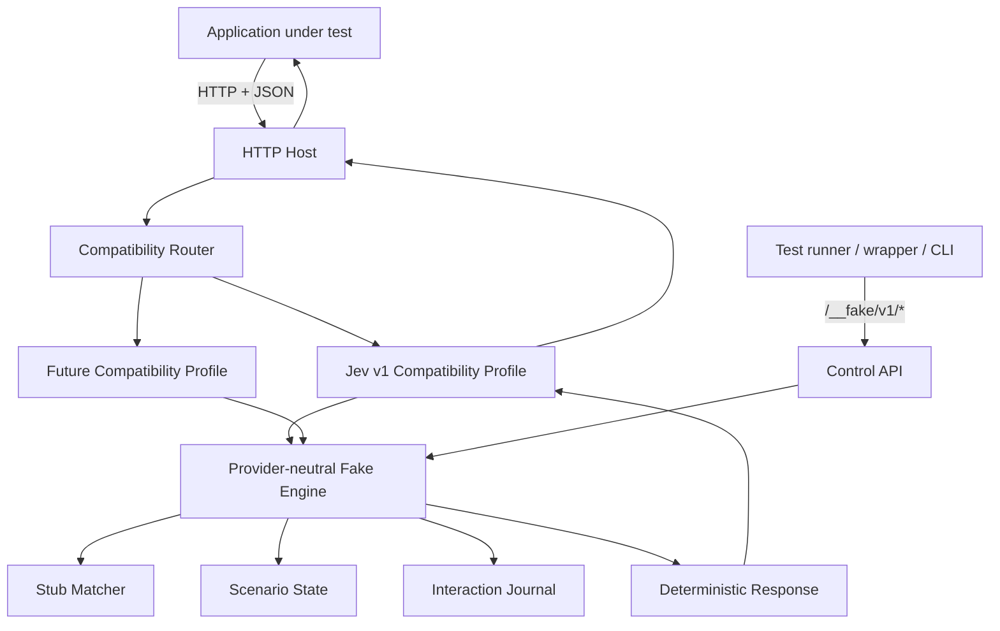

# fake-jev: Technical Specification and System Design

**Status:** Implementation-ready v1 specification  
**Date:** 2026-09-25  
**Primary implementation language:** Go  
**Primary distribution:** Native standalone binary  
**Planned secondary target:** WebAssembly  
**Primary interoperability boundary:** HTTP + JSON

---

## 1. Executive summary

`fake-jev` is a lightweight, deterministic, local test server for software that integrates with Jev or other System One-style decision APIs.

Its purpose is simple:

> Applications must be testable without starting a model, downloading model weights, making an external API call, requiring an API key, or spending money.

A developer should be able to replace:

```text
https://api.typesafe.ai
```

with:

```text
http://localhost:8787
```

and continue using the same application client, SDK, HTTP code, or provider implementation.

The first public compatibility target is the current Jev HTTP API because that is the most recognizable integration surface today. The architecture, however, must not treat the current Jev API as a System One standard. No official stable cross-provider System One protocol exists yet.

Therefore the central architectural rule is:

> **fake-jev emulates protocols; it does not define the protocol.**

Provider-specific routes, schemas, primitives, validation behavior, and response shapes live behind versioned compatibility profiles. The fake engine itself only knows how to match requests, select deterministic responses, advance scenarios, record interactions, and report unmatched calls.

The project is intentionally small. It is not an inference engine, model simulator, evaluation framework, generic service-virtualization platform, or attempt to standardize System One.

---

## 2. Problem statement

Applications using decision models such as Jev need normal software testing capabilities:

- unit and integration tests must run offline;
- CI must not depend on external services;
- CI must not spend tokens or API credits;
- tests must be deterministic and reproducible;
- developers must be able to force specific decisions and edge cases;
- tests must verify what the application asked the decision service;
- applications written in any language should be able to use the same fake;
- the fake must survive changes in provider APIs without requiring a redesign of its core.

An in-process mock provider solves only part of the problem. It is tied to a language or SDK and often bypasses serialization, HTTP integration, endpoint configuration, client behavior, authentication headers, and protocol validation.

`fake-jev` instead runs as a real local HTTP process and emulates the external service boundary.

```text
Production

Application
    |
    v
real SDK/client
    |
    v
Jev / provider


Testing

Application
    |
    v
same SDK/client
    |
    v
fake-jev
localhost
```

Only the endpoint changes.

---

## 3. Product definition

### 3.1 What fake-jev is

`fake-jev` is:

- a standalone local HTTP server;
- a deterministic test double for System One-style APIs;
- Jev-compatible at the HTTP boundary for its first compatibility profile;
- language-neutral from the application's point of view;
- controlled by a versioned configuration format and control API;
- suitable for local development, integration tests, end-to-end tests, CI, containers, and language-specific test wrappers;
- implemented in Go initially;
- designed so its core semantics can later be exposed through WebAssembly without redesigning the system.

### 3.2 What fake-jev is not

`fake-jev` is explicitly **not**:

- a replacement model;
- a local Jev implementation;
- a simulator of Jev's intelligence;
- a model-quality evaluation framework;
- a benchmark for comparing providers;
- a proxy that silently calls the real provider;
- a general-purpose WireMock replacement;
- a specification for what “System One compatible” means;
- a production inference service;
- an LLM-backed fake;
- a system that guesses what Jev would have answered.

The correct mental model is:

> **The developer decides what the fake answers. fake-jev makes the real application experience that answer through the real protocol boundary.**

---

## 4. Product principles

These principles are architectural constraints, not suggestions.

### 4.1 HTTP is the universal interoperability boundary

The primary public integration surface is HTTP + JSON.

Any language that can make an HTTP request can use `fake-jev`.

Language wrappers are convenience layers, not alternate implementations.

### 4.2 The fake engine is provider-neutral

The engine must not know that Jev has:

- `/v1/systemone`;
- `/v1/models`;
- `choice`;
- `noul`;
- `score`;
- `model`;
- `usage`.

Those are compatibility-profile concerns.

### 4.3 Provider APIs are dialects, not standards

The current Jev API must be treated as one external dialect.

A breaking Jev change or a new provider should normally require a new or updated compatibility profile, not modifications to the engine.

### 4.4 Jev is the product entry point, not the architecture

The project is called `fake-jev` because Jev is currently the recognizable name and expected discovery path.

Internally, provider-neutral terminology must be used except inside Jev-specific compatibility code.

Avoid names such as:

```text
JevMatcher
JevScenario
JevEngine
JevFixtureStore
```

Prefer:

```text
Matcher
Scenario
Engine
Exchange
Interaction
Stub
```

Jev-specific code belongs under a compatibility package.

### 4.5 Determinism by default

The same configuration and request sequence must produce the same responses and state transitions.

No randomness, clocks, external network calls, or hidden retries may affect normal matching behavior.

If deterministic pseudo-random behavior is introduced later, it must require an explicit seed.

### 4.6 Fail closed in tests

An unconfigured decision request must not silently receive a plausible default in strict mode.

Unknown requests must be visible and should fail CI unless the user explicitly configures fallback behavior.

### 4.7 Add before modifying

New provider protocols, new versions, new runtimes, and new wrappers should usually be added at the edges.

The core should not need modification when a new compatibility profile is introduced.

### 4.8 Do not abstract hypothetical requirements

The codebase must preserve clear boundaries without pre-building a framework for every imagined future use case.

Do not introduce plugin registries, provider factories, storage abstractions, transport factories, DI frameworks, or execution-backend hierarchies until a second real implementation requires them.

### 4.9 Zero-model execution is a product requirement

Running `fake-jev` must never require:

- model weights;
- GPU access;
- model runtimes;
- provider credentials;
- network access;
- paid APIs.

---

## 5. Relationship to system-one-core

`system-one-core` and `fake-jev` solve related but different testing problems.

`system-one-core` already supports a provider-neutral application abstraction and deterministic in-process test providers. That is ideal for fast unit tests inside TypeScript.

`fake-jev` operates one boundary lower:

```text
                 Application
                     |
             system-one-core
                     |
          HttpSystemOneProvider
                     |
                HTTP/JSON
                     |
                 fake-jev
```

This tests more of the real integration path:

- request construction;
- serialization;
- base URL configuration;
- HTTP client behavior;
- protocol validation;
- response decoding;
- application behavior.

The projects should complement each other. `fake-jev` must not depend on the TypeScript `system-one-core` package.

A cross-project integration test should eventually verify that `system-one-core` can point its `HttpSystemOneProvider` at `fake-jev` and execute representative `choice`, `noul`, and `score` requests.

---

## 6. Current Jev compatibility snapshot

This section records the initial upstream target. It is a compatibility input, not a core-domain definition.

**Snapshot date:** 2026-09-25  
**Observed upstream API description version:** `0.2.0`  
**Observed OpenAPI version:** `3.1.0`

The current public Jev/TypeSafe HTTP surface exposes:

```text
POST /v1/systemone
GET  /v1/models
```

The current `POST /v1/systemone` request contains:

```text
state
model
questions
```

`state` may be a string, object, or array.

`questions` is a map of caller-selected names to typed questions. The currently documented question types are:

```text
noul
choice
score
```

The response contains:

```text
model
answers
usage
```

Answers are keyed using the same question names as the request.

The current upstream API uses bearer authentication. `fake-jev` must accept normal Authorization headers so real clients work unchanged, but authentication is not required by default because the server is intended for local tests.

### 6.1 Compatibility-profile identity

The initial internal compatibility profile is:

```text
jev/v1
```

`jev` may be provided as a convenience alias for the recommended Jev profile.

The alias may move in future releases. CI and long-lived fixtures should prefer an explicit profile such as `jev/v1`.

The profile identifier is owned by `fake-jev`; it is not a claim about an official TypeSafe compatibility standard.

If the upstream API changes incompatibly, `fake-jev` may add:

```text
jev/v2
```

while preserving `jev/v1` for existing test suites.

---

## 7. High-level system design



### 7.1 Dependency direction

Dependencies point toward the core behavior.

```text
CLI --------------------+
                        |
HTTP host --------------+----> compatibility profile ----> engine
                        |
future WASM host -------+

control API -------------------------------> engine
```

The engine must not import:

```text
net/http
CLI packages
provider-specific packages
process management
Docker-specific code
npm-specific code
GitHub Actions code
```

Filesystem configuration loading belongs outside the engine.

---

## 8. Core domain model

The core domain intentionally contains only fake-server concepts.

Suggested conceptual types follow. Exact Go names may evolve, but the separation must remain.

### 8.1 Exchange

Represents a compatibility profile's normalized incoming operation.

```go
type Exchange struct {
    Profile   string
    Operation string
    Payload   Value
    Metadata  map[string]Value
}
```

`Value` is a JSON-compatible value tree or equivalent internal representation.

The engine must not require a compile-time union of `choice | noul | score`.

### 8.2 Stub

A deterministic rule containing:

```text
id
priority
matcher
response action
optional usage expectation
optional scenario condition/transition
```

### 8.3 Matcher

A matcher answers only:

```text
Does this stub match this exchange in the current scenario state?
```

The generic engine should support only generally useful matching primitives. Compatibility profiles may compile friendly provider-specific configuration into these primitives.

### 8.4 Response action

A response action produces a profile result from a matched exchange.

The core must support:

```text
static response
response sequence
error response
optional delay later
raw response escape hatch
```

### 8.5 Scenario state

Scenario state enables deterministic multi-call workflows.

Example:

```text
first retry decision  -> yes
second retry decision -> no
```

State must be in memory in v1.

### 8.6 Interaction journal

Every emulated provider request must be recorded with enough information for assertions and debugging.

Minimum fields:

```text
sequence number
profile
operation
received timestamp for diagnostics only
normalized request
raw request body when available
matched stub id or unmatched marker
response status
scenario state before/after when applicable
```

Timestamps must never participate in matching or response generation.

---

## 9. Compatibility profiles

A compatibility profile translates an external protocol into and out of the neutral engine.

A profile owns:

1. route recognition;
2. request decoding;
3. provider-specific validation;
4. provider-specific fixture helpers;
5. response construction/encoding;
6. protocol-specific defaults;
7. model-list behavior when relevant;
8. profile-specific conformance tests.

Conceptually:

```go
type Profile interface {
    ID() string
    MatchRoute(meta RequestMeta) bool
    Decode(input HostRequest) (Exchange, error)
    Encode(result Result) (HostResponse, error)
}
```

The actual interface should remain as small as practical. Do not add methods solely to anticipate future providers.

### 9.1 Compile-time registration in v1

Compatibility profiles are compiled into the binary in v1.

Do not implement dynamic native Go plugins.

A simple internal registration mechanism is sufficient:

```go
register(jevV1Profile)
```

### 9.2 Future plugin path

If third-party compatibility profiles become a real requirement, WebAssembly is the preferred future extension mechanism because it is portable and sandboxable.

No external plugin ABI is part of v1.

---

## 10. Public data plane

The **data plane** is what the application under test sees.

For the initial `jev/v1` profile:

```text
POST /v1/systemone
GET  /v1/models
```

The goal is wire compatibility sufficient for normal clients and SDKs to point to `fake-jev` by changing only their base URL.

### 10.1 Authentication

Default behavior:

- accept requests with no Authorization header;
- accept arbitrary bearer tokens;
- never validate tokens externally;
- never call a provider.

A future strict-auth simulation option may be added if real demand appears.

### 10.2 Model behavior

The fake does not execute a model.

For `/v1/models`, `jev/v1` returns configured fake model metadata.

Default model configuration should include a recognizable local entry such as:

```text
jev-latest
```

For `/v1/systemone`, unless overridden by a stub, the response model should normally echo the requested model or the profile's configured default.

Model metadata is test data, not a claim that a real model exists locally.

### 10.3 Usage behavior

Default fake token usage should be deterministic and free of tokenization dependencies.

Recommended default:

```json
{
  "input_tokens": 0,
  "output_tokens": 0
}
```

Tests may explicitly configure other values when application behavior depends on usage accounting.

### 10.4 Validation

The Jev compatibility profile should validate enough of the current contract to catch malformed application requests.

Validation belongs to the profile, not the engine.

For currently documented invalid Jev requests, the profile should return a `422`-compatible error shape where practical.

Exact upstream error wording and error ordering are not contractual unless captured by a specific compatibility test.

### 10.5 Unknown fields

Unknown-field behavior is a profile concern.

The core must not discard fields merely because it does not understand them.

Raw request data should remain available to the profile and interaction journal.

---

## 11. Control plane

The **control plane** is owned by `fake-jev` and is intentionally separate from emulated provider routes.

All v1 control endpoints live under:

```text
/__fake/v1
```

This namespace is versioned independently from provider compatibility profiles.

### 11.1 Required v1 endpoints

#### Health

```text
GET /__fake/v1/health
```

Returns server readiness and version information.

#### Metadata

```text
GET /__fake/v1/meta
```

Returns at minimum:

```json
{
  "serverVersion": "...",
  "controlApiVersion": "v1",
  "activeProfiles": ["jev/v1"],
  "mode": "strict"
}
```

#### Create stub

```text
POST /__fake/v1/stubs
```

Creates a dynamic stub. The request includes the target compatibility profile and profile-specific stub specification.

#### List stubs

```text
GET /__fake/v1/stubs
```

#### Delete stubs

```text
DELETE /__fake/v1/stubs
```

Clears dynamically registered stubs.

#### Interaction history

```text
GET /__fake/v1/requests
```

Returns recorded application interactions in deterministic sequence order.

#### Clear interaction history

```text
DELETE /__fake/v1/requests
```

#### Reset

```text
POST /__fake/v1/reset
```

Resets:

```text
dynamic stubs
scenario state
interaction history
unmatched-request state
```

Static file configuration is re-applied rather than deleted.

### 11.2 Verification

The server must internally track:

- unmatched requests;
- stub invocation counts;
- optional expected minimum/exact/maximum counts.

A CLI command will use the control API to turn these into CI exit codes.

A dedicated HTTP verification endpoint is optional for v1; wrappers may implement verification by reading control-plane state.

### 11.3 Control-plane stability

The control API is one of the contracts the project owns.

Breaking changes require a new version namespace such as:

```text
/__fake/v2
```

---

## 12. Configuration and fixture format

The file format is also a project-owned contract and must be versioned independently from Jev.

Recommended top-level shape:

```yaml
schemaVersion: 1

server:
  host: 127.0.0.1
  port: 8787

mode: strict

compatibility:
  - jev/v1

stubs: []
```

JSON should be supported using the same logical schema.

YAML is the primary human-authored format.

### 12.1 Stable envelope, profile-specific body

The outer configuration structure is owned by `fake-jev`.

Provider-specific matching and response helpers are owned by the compatibility profile.

Example:

```yaml
schemaVersion: 1
mode: strict
compatibility:
  - jev/v1

stubs:
  - id: issue-routing
    profile: jev/v1
    when:
      operation: systemone
      questions:
        route: choice
        urgent: noul

    then:
      answers:
        route:
          choice: backend
          confidence: 0.91
        urgent:
          noul: 0.94
```

The generic engine does **not** parse `choice` or `noul`. The Jev profile compiles this friendly representation into neutral matching and response behavior.

### 12.2 Strict matching

Strict mode is the default.

If no stub matches an application request, the server must:

1. record the interaction as unmatched;
2. log a clear diagnostic;
3. return a non-success response;
4. cause `fake-jev verify` to fail.

Recommended unmatched response status for v1:

```text
501 Not Implemented
```

Recommended diagnostic body:

```json
{
  "error": "fake_jev_unmatched_request",
  "message": "No configured stub matched this request.",
  "profile": "jev/v1",
  "operation": "systemone"
}
```

The response must clearly identify itself as a fake-server failure rather than pretend to be a real model judgment.

### 12.3 Match priority

Matching must be deterministic.

Recommended order:

1. highest numeric priority;
2. most specific matcher if specificity can be computed reliably;
3. declaration order as the final tie breaker.

If specificity becomes ambiguous, prefer explicit priority plus declaration order rather than complex hidden scoring.

A simpler v1 rule is acceptable:

```text
priority descending, then declaration order
```

### 12.4 Sequences

A stub may define sequential results:

```yaml
then:
  sequence:
    - answers:
        retry:
          noul: 0.95
    - answers:
        retry:
          noul: 0.10
```

Default sequence exhaustion behavior must be explicit.

Recommended strict default:

```text
sequence exhausted -> unmatched/failure
```

An optional `repeatLast: true` may be supported later.

### 12.5 Invocation expectations

Stubs may optionally specify expectations:

```yaml
expect:
  exactly: 1
```

Future-compatible shapes may include:

```yaml
expect:
  atLeast: 1
  atMost: 3
```

`fake-jev verify` checks expectations.

### 12.6 Raw escape hatch

A raw response escape hatch is required so users can test newly introduced provider features before `fake-jev` gains first-class support.

Example:

```yaml
then:
  raw:
    status: 200
    headers:
      content-type: application/json
    body:
      some_future_field: true
```

Raw mode intentionally bypasses compatibility-profile response helpers and some validation.

This is an escape hatch, not the preferred fixture style.

---

## 13. Jev v1 fixture helpers

The `jev/v1` profile should provide concise helpers for current response types.

### 13.1 Noul

Explicit numeric probability:

```yaml
urgent:
  noul: 0.94
```

Convenience boolean MAY be supported:

```yaml
urgent:
  noul: true
```

with deterministic conversion:

```text
true  -> 1.0
false -> 0.0
```

### 13.2 Choice

Minimal fixture:

```yaml
route:
  choice: backend
```

The profile may derive a valid one-hot distribution from the request criteria:

```text
selected choice -> 1.0
all others      -> 0.0
confidence      -> 1.0
```

Explicit values override generated defaults:

```yaml
route:
  choice: backend
  confidence: 0.91
  probabilities:
    frontend: 0.06
    backend: 0.91
    infra: 0.03
```

The profile must reject a selected choice that does not exist in the request criteria unless raw mode is used.

### 13.3 Score

Minimal fixture:

```yaml
severity:
  score: 2
```

The profile may derive:

- legend from request criteria;
- deterministic probabilities;
- default confidence `1.0`.

For fractional scores, an implementation may distribute probability between adjacent score levels so the expected value equals the requested score.

Explicit legend/probability/confidence values override generated defaults.

### 13.4 Mixed requests

A single `/v1/systemone` call may contain heterogeneous questions. The profile must support mixed `choice`, `noul`, and `score` answers in one response.

### 13.5 Partial fixtures

Default v1 behavior should be strict: every requested question must receive a configured or derivable answer from the matched stub.

Do not silently invent an answer for an unconfigured question in strict mode.

---

## 14. Auto mode

Auto mode is useful for local development but less safe for CI.

It is optional for the first implementation milestone and must not delay strict mode.

If implemented:

```bash
fake-jev serve --mode auto
```

The active compatibility profile deterministically generates protocol-valid responses without intelligence.

Important requirements:

- no model execution;
- no semantic claim;
- same request produces the same answer;
- generated behavior belongs to the compatibility profile, not the engine;
- CI documentation must recommend strict mode.

Auto mode exists to answer:

> “Can my application run against the protocol?”

It does not answer:

> “What would Jev decide?”

---

## 15. CLI specification

The CLI is implemented in Go in the same repository and compiled into the same native binary.

Avoid a heavy CLI framework initially. Standard library argument parsing or a very small internal command layer is preferred.

### 15.1 `serve`

```bash
fake-jev serve \
  --host 127.0.0.1 \
  --port 8787 \
  --config ./fake-jev.yaml
```

Required useful flags:

```text
--host
--port
--config
--compat
--mode
--log-format
--ready-file
```

`--port 0` should request an ephemeral port.

When port `0` is used, wrappers must have a stable machine-readable way to discover the selected port. Do not require wrappers to scrape human log output.

Recommended solution:

```bash
--ready-file /tmp/fake-jev-ready.json
```

Example:

```json
{
  "url": "http://127.0.0.1:49152",
  "port": 49152,
  "pid": 1234,
  "controlApiVersion": "v1"
}
```

### 15.2 `validate`

```bash
fake-jev validate ./fake-jev.yaml
```

Validates:

- top-level config schema;
- known compatibility profiles;
- profile-specific fixture shape;
- obvious impossible responses such as unknown choice labels when statically knowable.

No server is started.

### 15.3 `verify`

```bash
fake-jev verify --url http://127.0.0.1:8787
```

Exit `0` only if configured verification rules pass.

Default strict checks:

```text
no unmatched requests
all exact/minimum expectations satisfied
no sequence-exhaustion failures
```

### 15.4 `run`

Recommended CI-friendly orchestration command:

```bash
fake-jev run --config ./fake-jev.yaml -- npm test
```

Behavior:

1. start fake server on an available port;
2. expose `FAKE_JEV_URL` to the child process;
3. optionally map the URL into a caller-selected environment variable;
4. run the child command;
5. verify fake-server expectations;
6. stop the server;
7. exit non-zero if either the child command or verification fails.

Example:

```bash
fake-jev run \
  --config ./fake-jev.yaml \
  --url-env JEV_BASE_URL \
  -- npm test
```

This is the preferred high-level CI UX because it guarantees lifecycle cleanup and verification.

### 15.5 `version`

```bash
fake-jev version
```

Prints binary version and built-in compatibility profiles.

---

## 16. Language wrappers

Potential wrappers include:

```text
fake-jev-ts
fake-jev-py
fake-jev-rs
fake-jev-go
fake-jev-java
```

Wrappers are optional conveniences.

They must not reimplement the fake engine.

Their responsibilities may include:

- locate/download the native binary;
- start and stop the server;
- allocate a port;
- wait for readiness;
- configure stubs through the control API;
- reset state;
- fetch interactions;
- expose assertion-friendly helpers;
- eventually choose a WASM-hosted execution strategy.

Example TypeScript UX:

```ts
const fake = await createFakeJev({
  mode: "strict",
});

await fake.stub({
  profile: "jev/v1",
  when: {
    operation: "systemone",
    questions: { urgent: "noul" },
  },
  then: {
    answers: {
      urgent: { noul: 0.95 },
    },
  },
});

console.log(fake.url);

await fake.reset();
await fake.stop();
```

The wrapper's semantics should map directly to the versioned control API.

### 16.1 Runtime strategy must remain replaceable

A future TypeScript wrapper could support:

```text
native binary
WASM hosted in Node/Deno
remote existing fake-jev server
```

The user-facing wrapper API should not need to change solely because the execution strategy changes.

---

## 17. Go implementation architecture

Recommended repository layout:

```text
fake-jev/
|
|-- cmd/
|   `-- fake-jev/
|       `-- main.go
|
|-- internal/
|   |-- engine/
|   |   |-- engine.go
|   |   |-- exchange.go
|   |   |-- stub.go
|   |   |-- matcher.go
|   |   |-- scenario.go
|   |   `-- journal.go
|   |
|   |-- compat/
|   |   `-- jev/
|   |       `-- v1/
|   |           |-- profile.go
|   |           |-- routes.go
|   |           |-- request.go
|   |           |-- response.go
|   |           |-- validation.go
|   |           |-- fixture.go
|   |           `-- models.go
|   |
|   |-- host/
|   |   `-- http/
|   |       |-- server.go
|   |       `-- router.go
|   |
|   |-- control/
|   |   |-- api.go
|   |   `-- handlers.go
|   |
|   |-- config/
|   |   |-- load.go
|   |   |-- schema.go
|   |   `-- validate.go
|   |
|   `-- cli/
|       |-- serve.go
|       |-- run.go
|       |-- verify.go
|       |-- validate.go
|       `-- version.go
|
|-- spec/
|   |-- control-api.openapi.yaml
|   `-- config.schema.json
|
|-- test/
|   |-- conformance/
|   `-- integration/
|
|-- examples/
|-- docs/
|-- Dockerfile
|-- go.mod
|-- LICENSE
`-- README.md
```

### 17.1 Dependency policy

Prefer the Go standard library.

Expected standard-library building blocks include:

```text
net/http
encoding/json
context
sync
os
os/exec
flag or equivalent small parser
```

One mature YAML dependency is acceptable.

Do not add frameworks for routing, dependency injection, logging, configuration, or testing unless a real need appears.

### 17.2 Engine purity

`internal/engine` must not import:

```text
net/http
os/exec
compat/jev
cli
control API packages
```

Avoid filesystem access inside the engine.

Configuration is loaded and compiled outside, then passed to the engine.

### 17.3 Concurrency

The HTTP server may process multiple requests concurrently.

The engine must protect:

- scenario state;
- sequence counters;
- interaction journal;
- dynamic stubs;
- expectation counters.

Behavior must remain deterministic for a defined request order.

Tests involving concurrent requests should not depend on unspecified arrival ordering unless the test explicitly controls it.

---

## 18. WebAssembly strategy

WASM is a planned secondary target, not a v1 blocker.

The project should be written so a future build can reuse the engine semantics without rewriting them.

### 18.1 Why WASM matters

Potential benefits include:

- embedding in Node.js and Deno test processes;
- browser-based playgrounds;
- portable execution in environments with a WASM runtime;
- sandboxed third-party compatibility adapters later;
- one engine implementation shared by multiple language wrappers.

### 18.2 What must be true now

To preserve the option:

- core behavior must not depend on HTTP;
- core behavior must not depend on process management;
- core behavior should avoid OS-specific APIs;
- request/response data should be representable as JSON-compatible values;
- deterministic state transitions should be callable as ordinary functions/methods;
- host responsibilities must remain outside the engine.

### 18.3 Native remains the default

The default runtime remains the native Go binary because it gives the simplest UX:

```bash
./fake-jev serve
```

WASM should be added only when an actual embedding use case justifies the host/runtime complexity.

### 18.4 Future WASM host shape

Conceptually:

```text
Node / Deno / Browser / other host
              |
              v
     fake engine WASM module
              |
              v
    deterministic exchange API
```

For normal application integration, a wrapper may still expose a localhost HTTP server so the application contract remains unchanged.

### 18.5 Future external plugins

If external compatibility plugins become necessary, prefer a WASM component boundary over Go native plugins.

Do not define that ABI in v1.

---

## 19. Security model

`fake-jev` is a local development and test utility.

### 19.1 Safe defaults

Default bind address:

```text
127.0.0.1
```

Do not bind publicly by default.

Users running in Docker may explicitly choose:

```text
0.0.0.0
```

### 19.2 No network egress

Core fake behavior must not make external network requests.

A test should be able to run `fake-jev` in an environment with outbound networking disabled.

### 19.3 No arbitrary code execution in fixtures

Do not support JavaScript expressions, Go templates with dangerous functions, shell commands, dynamic eval, or arbitrary code callbacks in configuration.

Fixtures are data.

If programmable extensions are required later, design an explicit sandboxed mechanism rather than adding `eval`-style features.

### 19.4 Resource limits

The HTTP host should apply reasonable limits to:

- request body size;
- control API payload size;
- interaction journal growth when configurable;
- header sizes through standard server settings.

Defaults should be generous enough for normal System One state payloads but bounded.

### 19.5 Control API exposure

The control API shares the same local server in v1 for simplicity.

Documentation must warn users not to expose the server to untrusted networks.

A separate control listener or auth mechanism may be considered later if real remote use cases appear.

---

## 20. Observability and diagnostics

The fake server should optimize logs for test debugging rather than production telemetry.

Default human log examples:

```text
fake-jev listening on http://127.0.0.1:8787
profile jev/v1 enabled
matched request #3 -> stub issue-routing
unmatched request #4 -> POST /v1/systemone
```

Optional structured logging:

```bash
--log-format json
```

Do not log secrets by default.

Authorization values must be redacted.

Large state/request bodies should be truncated in normal logs while remaining available through explicitly requested interaction data subject to configured limits.

---

## 21. Error model

There are two categories of errors.

### 21.1 Emulated-provider errors

These intentionally reproduce a provider response for an application test.

Example fixture:

```yaml
then:
  raw:
    status: 429
    body:
      detail: rate limited
```

These are part of the configured application scenario.

### 21.2 Fake-server errors

These indicate problems in the test harness itself:

```text
unmatched request
invalid fake configuration
exhausted response sequence
unknown compatibility profile
internal fake server failure
```

Fake-server errors must identify themselves clearly and must be recorded for `verify`.

Do not disguise test-harness failures as plausible model responses.

---

## 22. Testing strategy for fake-jev itself

The fake server must be at least as deterministic and well-tested as the software it is intended to test.

### 22.1 Engine unit tests

Cover:

- deterministic matching;
- priority order;
- sequence consumption;
- sequence exhaustion;
- scenario transitions;
- journal ordering;
- reset behavior;
- expectation counters;
- concurrent safety.

### 22.2 Property and fuzz testing

Use Go's built-in fuzzing where useful for:

- JSON request parsing;
- malformed control payloads;
- matcher input;
- state transitions;
- compatibility decoder robustness.

The invariant is:

> Untrusted input may produce a controlled error, but must not panic or corrupt server state.

### 22.3 Jev compatibility golden tests

Maintain offline golden fixtures for representative current Jev requests and responses:

- noul;
- choice;
- score;
- mixed questions;
- structured state;
- `/v1/models`;
- malformed requests;
- invalid criteria;
- unknown choice configured by fixture;
- explicit raw responses.

### 22.4 HTTP integration tests

Start the real HTTP host using an ephemeral port and test through HTTP rather than calling handlers directly.

### 22.5 Control API tests

Test dynamic registration, request history, reset, and verification.

### 22.6 system-one-core integration

Maintain a smoke test that points `system-one-core`'s HTTP provider to a running `fake-jev` instance.

This is optional as a cross-repository test if repository boundaries make it difficult, but it is strongly recommended before public releases.

### 22.7 Optional live upstream drift tests

A scheduled/manual job may call the real Jev API to detect compatibility drift.

Rules:

- never required for normal PR CI;
- never required for contributors without credentials;
- never part of deterministic test correctness;
- credentials stored only in CI secrets;
- failures indicate compatibility investigation, not engine failure.

This is the only area where real API cost is acceptable.

---

## 23. CI requirements

Normal PR CI must require no model, no provider API key, and no paid external service.

Recommended checks:

```text
go test ./...
go test -race ./...        # supported runner(s)
go vet ./...
config/schema validation
build matrix
integration tests
```

Where practical, run deterministic integration tests with outbound network access disabled.

### 23.1 Build matrix

Initial release targets:

```text
linux/amd64
linux/arm64
darwin/amd64
darwin/arm64
windows/amd64
```

`windows/arm64` may be added when release tooling and demand justify it.

### 23.2 Release integrity

Release artifacts should include checksums.

Releases should be reproducible enough that the build process is documented and automated.

---

## 24. Distribution

The implementation language should be invisible to most users.

### 24.1 Native binaries

GitHub releases should provide platform-specific binaries.

Typical UX:

```bash
fake-jev serve --config fake-jev.yaml
```

### 24.2 Docker

Provide a small image suitable for CI and local use.

The server should support container-friendly binding through configuration.

Example:

```bash
docker run --rm -p 8787:8787 fake-jev ...
```

The final image should contain only what is required to run the binary and any required CA/system files.

### 24.3 npm convenience package

A future npm package may provide:

```bash
npx fake-jev
```

It should act as an installer/launcher for the appropriate native binary rather than reimplementing the server in JavaScript.

### 24.4 Homebrew

Homebrew distribution is desirable after the binary interface stabilizes.

### 24.5 GitHub Action

A thin GitHub Action can later download/start the correct binary and perform post-job verification.

It must remain a wrapper around the same server, not a separate implementation.

---

## 25. Versioning strategy

There are multiple independent version axes. Do not collapse them.

### 25.1 Product version

The `fake-jev` binary follows semantic versioning.

Example:

```text
fake-jev 1.2.0
```

### 25.2 Control API version

Versioned in the URL:

```text
/__fake/v1
```

### 25.3 Configuration schema version

Versioned in the file:

```yaml
schemaVersion: 1
```

### 25.4 Compatibility-profile version

Example:

```text
jev/v1
jev/v2
```

These versions represent `fake-jev`'s preserved compatibility behavior, not an official System One standard.

### 25.5 Wrapper version

Language wrappers have their own package versions but must declare the control API and minimum server versions they support.

Wrappers should use `GET /__fake/v1/meta` for compatibility checks instead of assuming behavior from the binary version alone.

---

## 26. Backward compatibility rules

### 26.1 Core behavior

Internal engine APIs are not public contracts in v1 and may change freely as long as public behavior remains stable.

### 26.2 Config

A config with `schemaVersion: 1` should continue to work throughout the major product line unless a documented security issue makes that impossible.

### 26.3 Jev profiles

Once `jev/v1` is released, breaking its observable behavior should be avoided.

If upstream Jev changes incompatibly, prefer adding `jev/v2`.

### 26.4 Aliases

Aliases such as:

```text
jev
```

may move to a newer profile and therefore should not be used when exact CI reproducibility matters.

---

## 27. Example end-to-end workflow

### Configuration

```yaml
schemaVersion: 1
mode: strict
compatibility:
  - jev/v1

stubs:
  - id: route-backend
    profile: jev/v1
    when:
      operation: systemone
      questions:
        route: choice
        urgent: noul
    then:
      answers:
        route:
          choice: backend
          confidence: 0.91
          probabilities:
            frontend: 0.06
            backend: 0.91
            infra: 0.03
        urgent:
          noul: 0.94
    expect:
      exactly: 1
```

### Start server

```bash
fake-jev serve --config ./fake-jev.yaml
```

### Application configuration

```text
JEV_BASE_URL=http://127.0.0.1:8787
JEV_API_KEY=fake
```

### Application request

```text
POST /v1/systemone
```

The application uses its normal production client.

### Verification

```bash
fake-jev verify --url http://127.0.0.1:8787
```

CI fails if:

- the request did not match the stub;
- the stub was not used exactly once;
- an unexpected decision call occurred;
- the response sequence was exhausted.

---

## 28. Preferred CI workflow

The cleanest usage is the orchestration command:

```bash
fake-jev run \
  --config ./test/fake-jev.yaml \
  --url-env JEV_BASE_URL \
  -- npm test
```

Lifecycle:

```text
start fake-jev
      |
      v
allocate port
      |
      v
set JEV_BASE_URL for child
      |
      v
run tests
      |
      v
verify fake interactions
      |
      v
stop server
      |
      v
return combined exit status
```

No model is started at any point.

---

## 29. Open/closed architecture rule

The project should optimize for being:

> **open to new compatibility profiles and runtimes, closed to unnecessary core modification.**

A healthy future change should look like this:

### New provider

```text
add internal/compat/provider-x/v1
add tests
register profile
```

Not:

```text
modify engine request union
modify matcher
modify scenario engine
modify control API
modify every wrapper
```

### Breaking Jev API

```text
add jev/v2
preserve jev/v1
```

### WASM support

```text
add WASM host/bridge
reuse engine semantics
```

### TypeScript wrapper

```text
add package that controls existing server
```

This is the core extensibility test for architectural decisions.

---

## 30. Explicit anti-patterns

Implementation agents should reject the following designs unless this specification is intentionally revised.

### 30.1 Hard-coding current primitives into the engine

Do not define the engine around:

```text
Choice | Noul | Score
```

That belongs to `compat/jev/v1` or another profile.

### 30.2 Building one fake per language

Do not build separate behavioral implementations for Node, Python, Rust, and Java.

There is one fake server implementation.

Wrappers control it.

### 30.3 Using a model to fake the model

Do not call a local LLM, Jev, Reflex, or any other decision model to produce normal fake responses.

### 30.4 Silent defaults in strict mode

Do not return `0.5`, the first choice, or a random score merely because no test fixture matched.

### 30.5 Treating the current Jev API as permanent

Do not leak Jev route/schema concepts into the engine.

### 30.6 Generic framework construction

Do not build a full generic HTTP-mocking platform.

The neutral core exists to isolate compatibility changes, not to compete with WireMock.

### 30.7 Native Go plugin dependency

Do not base extensibility on Go's native plugin mechanism.

### 30.8 Public bind by default

Do not listen on `0.0.0.0` by default.

### 30.9 Scraping CLI logs from wrappers

Wrappers should use a stable readiness mechanism such as `--ready-file` and the control API.

---

## 31. Implementation phases

The phases below intentionally build vertical slices rather than speculative infrastructure.

### Phase 0: Repository foundation

Deliver:

- Go module;
- CLI entry point;
- basic version command;
- CI for test/vet/build;
- initial architecture packages;
- README with product boundaries.

Acceptance:

```text
go test ./...
go vet ./...
go build ./cmd/fake-jev
```

### Phase 1: Minimal Jev-compatible strict server

Deliver:

- HTTP host;
- `jev/v1` profile;
- `POST /v1/systemone`;
- `GET /v1/models`;
- static YAML/JSON config;
- strict matching;
- noul/choice/score response helpers;
- unmatched request failure;
- interaction journal.

Acceptance:

A real HTTP client can point at localhost and receive configured responses for all three current Jev question types without network access or a model.

### Phase 2: Control API

Deliver:

- `/__fake/v1/health`;
- `/__fake/v1/meta`;
- dynamic stub registration;
- list/clear stubs;
- request history;
- reset;
- expectation counters.

Acceptance:

Tests can configure and inspect a long-running fake server without restarting it.

### Phase 3: CI ergonomics

Deliver:

- `validate`;
- `verify`;
- `run`;
- ephemeral ports;
- ready-file;
- combined exit status;
- strict expectation verification.

Acceptance:

A CI job can run:

```bash
fake-jev run --config fake-jev.yaml --url-env JEV_BASE_URL -- npm test
```

with no manual process management.

### Phase 4: Hardening and release

Deliver:

- race tests;
- fuzz tests;
- body limits;
- log redaction;
- build matrix;
- release artifacts and checksums;
- Docker image;
- examples for TypeScript, Python, Go, and raw curl/HTTP.

Acceptance:

A user can download one binary or container and use it without installing Go.

### Phase 5: Ecosystem wrappers

Start with TypeScript because it is likely to have the highest immediate testing demand.

Deliver:

- `fake-jev-ts`;
- lifecycle management;
- dynamic stubs;
- request inspection;
- reset;
- server-version compatibility check.

Do not duplicate engine behavior.

### Phase 6: WASM experiment

Only after the native design is stable.

Validate:

- engine can be compiled/exposed to WASM cleanly;
- Node/Deno host can execute deterministic exchanges;
- wrapper semantics remain the same;
- binary and WASM conformance tests produce equivalent results.

WASM does not become a required runtime unless it provides measurable ecosystem value.

---

## 32. Definition of done for v1

`fake-jev` v1 is complete when all of the following are true:

- a standalone native binary runs on supported Linux and macOS targets, with Windows support in the release matrix;
- no model or external service is required;
- the server binds to localhost by default;
- an application can point its Jev-compatible client to `localhost`;
- current Jev-style `noul`, `choice`, `score`, mixed questions, and model listing are supported by `jev/v1`;
- responses are deterministic;
- strict mode is the default;
- unmatched requests are observable and fail verification;
- fixture files are versioned and validated;
- the control API is versioned;
- request history is inspectable;
- scenario sequences work;
- `validate`, `verify`, and `run` support CI use;
- core engine packages do not depend on Jev semantics or HTTP;
- Jev-specific behavior is isolated to `compat/jev/v1`;
- no external network access occurs during normal operation;
- test suites cover the engine, HTTP host, control API, and Jev adapter;
- the architecture does not require WASM, but does not block a future WASM host;
- public documentation explicitly states that fake-jev does not simulate model quality or intelligence.

---

## 33. Decisions intentionally deferred

These should not block v1:

- browser-hosted WASM distribution;
- WASM component-model plugin ABI;
- third-party dynamic compatibility plugins;
- persistent state or databases;
- UI/dashboard;
- remote multi-user server operation;
- authentication for the control plane;
- advanced latency/fault injection;
- record/replay against real providers;
- automatic provider OpenAPI ingestion;
- provider-quality evaluation;
- probabilistic/fuzz response generation;
- generic HTTP mocking outside the System One testing domain.

They may be reconsidered only when a concrete use case exists.

---

## 34. Architectural decision summary

| Decision | v1 choice | Reason |
|---|---|---|
| Product name | `fake-jev` | Discoverable around the currently recognizable provider |
| Core semantics | Provider-neutral fake engine | Avoid coupling to an unstable/non-standard protocol |
| Implementation | Go | Small standalone service, simple concurrency, strong cross-platform binary story |
| CLI | Go, same binary | No extra runtime or second implementation language |
| Primary interface | HTTP + JSON | Universal language/runtime compatibility |
| Current provider target | Versioned `jev/v1` profile | Emulate today without declaring a standard |
| Control interface | `/__fake/v1/*` | Stable project-owned automation surface |
| Fixture format | Versioned YAML/JSON | Human-readable, deterministic, language-neutral |
| Default mode | Strict | Unexpected model calls must not silently pass tests |
| State | In memory | Lean and sufficient for test use |
| Wrappers | Thin lifecycle/control clients | No behavioral duplication |
| WASM | Planned secondary target | Future embedding/browser/sandbox reach without complicating v1 |
| Dynamic plugins | Deferred | No proven requirement; avoid premature framework design |
| External model calls | Never in normal operation | Cost-free deterministic tests |

---

## 35. One-sentence implementation brief

> Build `fake-jev` as a small Go HTTP test server whose provider-neutral deterministic engine is isolated from versioned protocol adapters, starting with a Jev-compatible `jev/v1` profile, with strict fixtures, a stable control API, CI-oriented lifecycle commands, thin future language wrappers, and an architecture that can later expose the same engine through WebAssembly without changing the application's HTTP contract.

---

## 36. Guidance for implementation agents

When implementing this specification, optimize in this order:

1. correctness and deterministic behavior;
2. clean architectural boundaries;
3. compatibility with real application clients;
4. excellent failure diagnostics;
5. minimal dependencies and operational footprint;
6. testability;
7. distribution ergonomics;
8. future extensibility;
9. micro-optimizations.

When an implementation choice conflicts with hypothetical future flexibility, prefer the simplest implementation that preserves the explicit boundaries in this document.

When uncertain whether functionality belongs in the engine or a compatibility profile, ask:

> “Would this concept still exist if Jev used completely different endpoints and decision primitives tomorrow?”

If the answer is no, it belongs outside the engine.

When uncertain whether to introduce a new abstraction, ask:

> “Do we have a second real implementation that requires this abstraction today?”

If the answer is no, keep the boundary clean but defer the abstraction.

The target is not a framework with maximum flexibility.

The target is a small, dependable test server whose architecture makes future change local instead of contagious.
